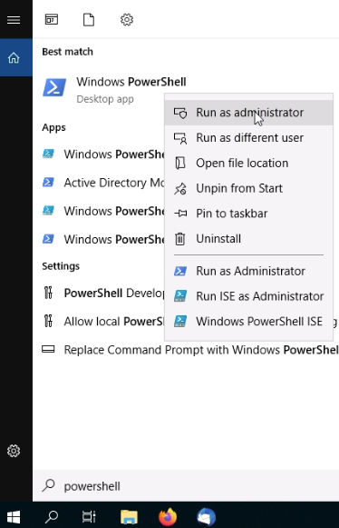
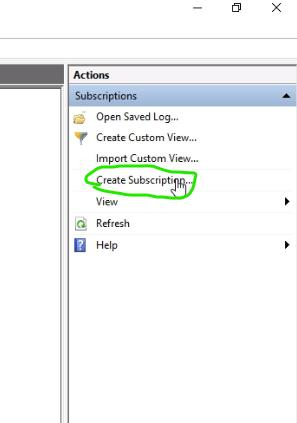

# Configuring System Monitoring

> **Scenario summary:** We will configure centralised Windows Event Collection and verify subscriptions. The guide is written for GitHub with step‑by‑step actions, exact commands, and screenshots stored in `./images/` (e.g., `./images/00.png`).

## Objectives
- Enable Windows Event Collector on the collector host
- Allow the collector to read logs from the source host
- Confirm events flow and are queryable

## Tools & Techniques
- Windows Event Collector (WEC)
- WinRM, Firewall rules
- Group Policy / Local Security Policy
- PowerShell: `wecutil`, `winrm`, `Get-WinEvent`

