# Configuring System Monitoring
This case focuses on centralized log management. As a network grows, managing the logs of the systems and applications can be complicated. Collecting logs into a single location simplifies log management. In this case, we will configure centralized logging from one Windows server system to another.

## Understand the environment
we will work from two virtual machines in this case, including a VM named DC10 hosting Windows Server 2019 and MS10 hosting Windows Server 2016.

## Objectives
- apply common security techniques to computing resources. 
- Explain security alerting and monitoring concepts and tools. 
- use data sources to support an investigation.

## Tools & Techniques
- Windows Event Collector (WEC)
- WinRM, Firewall rules
- Group Policy / Local Security Policy
- PowerShell: `wecutil`, `winrm`, `Get-WinEvent`

## Configure centralized logging 

Centralized logging is an essential service of modern security management. Having logs duplicated to a single location facilitates analysis and backup operations. In this exercise, we will configure centralized logging on Windows systems. 

Select the DC10 VM sign in as Administrator 

The DC10 virtual machine will be used as the collector and the MS10 virtual machine will be used as the logging source. 

Minimize or close Server Manager if it appears.  

Select Type here to search from the taskbar, type powershell, right-click Windows PowerShell from the results, then select Run as administrator. 


Select Yes on the User Account Control window. 


Select the empty area of the Administrator: Windows PowerShell console, then select the   below to paste the PowerShell script into the VM: 

```powershell
Import-Module GroupPolicy 
 
# Get the cc-domain-default GPO object 
$gpo = Get-GPO -Name "cc-domain-default" 
 
# Get the Group Policy Preference registry key for WinRM 
$winrmRegKey = "HKEY_LOCAL_MACHINE\SOFTWARE\Policies\Microsoft\Windows\WinRM\Service" 
 
# Set the value of the "IPv4Filter" registry value to "*" 
Set-GPRegistryValue -Name $gpo.DisplayName -Key $winrmRegKey -ValueName "IPv4Filter" -Type String -Value "*" 
 
# Refresh the Group Policy settings on the local computer 
gpupdate /force 
```

Press Enter on your keyboard for the last line to be executed. we should see the message "Updating policy…" 


This PowerShell script is used to change the default setting of the WinRM listener from empty to *. The default setting acts as a deny-all, while the asterisks act like an accept-all.

When it’s complete it should display: 

- “Computer Policy update has completed successfully.” 
- “User Policy update has completed successfully.” 


In the Administrator: Windows PowerShell console, enter: 

```powershell
wecutil qc. 
```
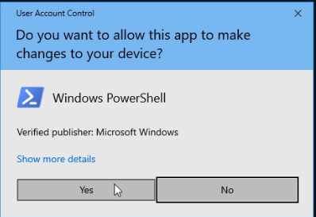
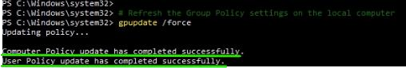
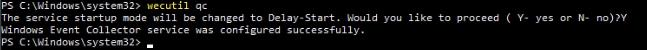
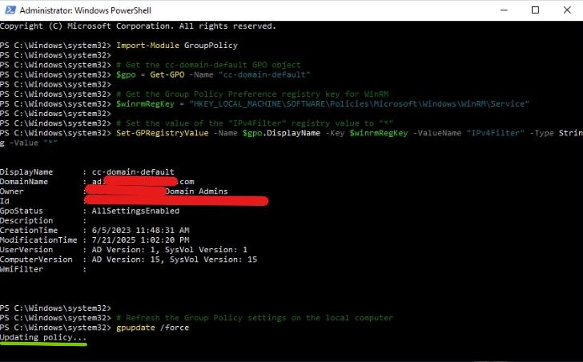
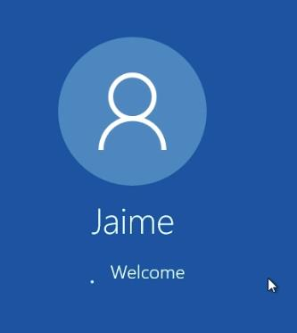
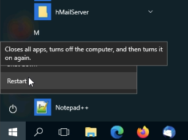

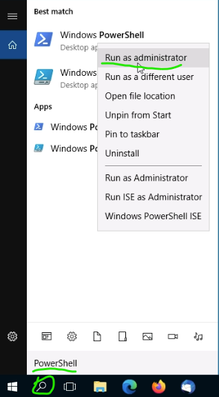
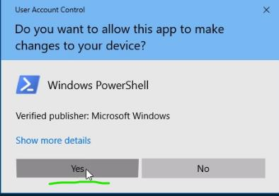
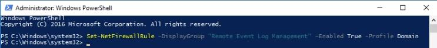
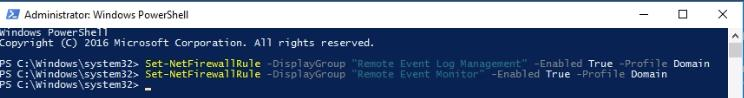
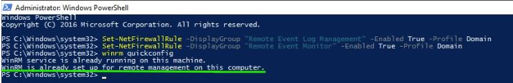
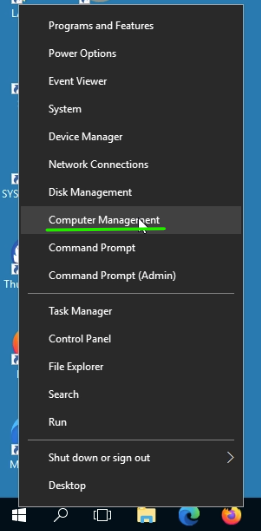
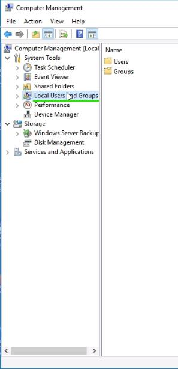
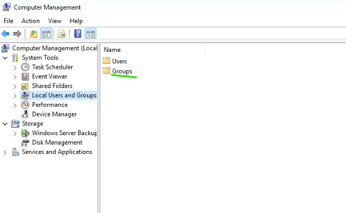
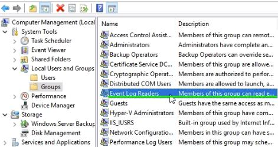
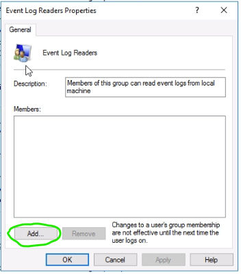
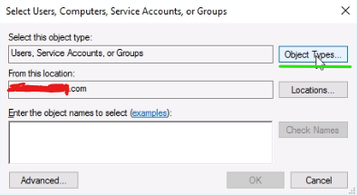
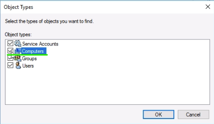
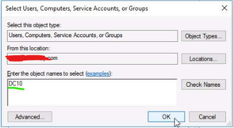
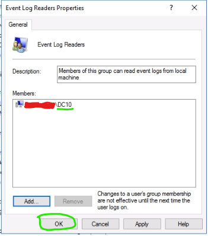

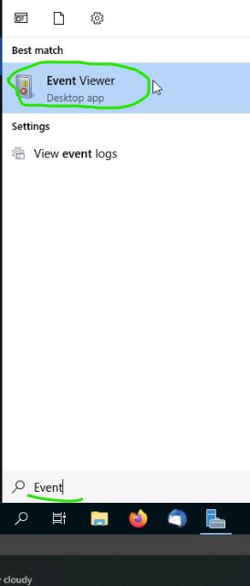
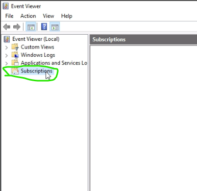
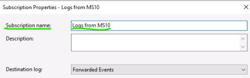
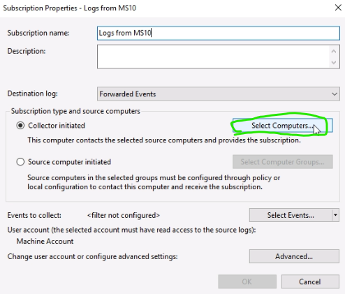
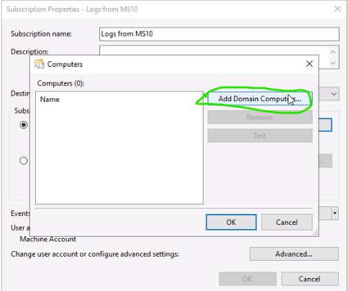
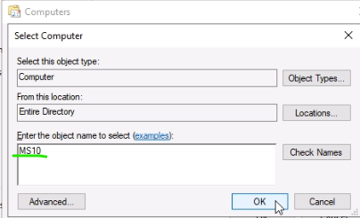
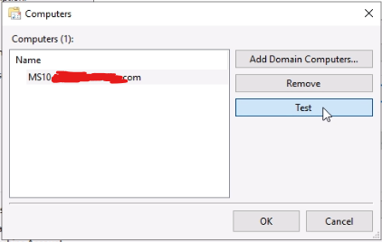
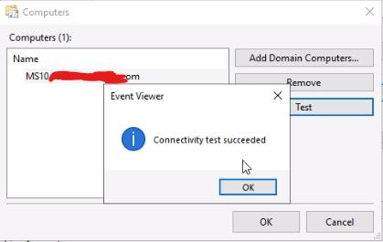
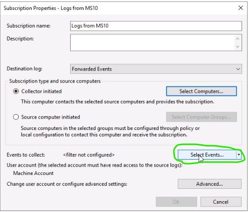
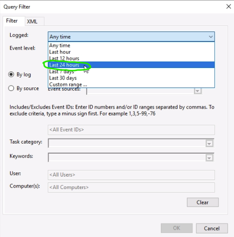
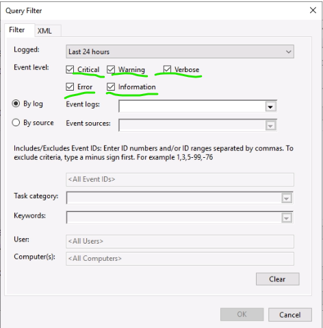
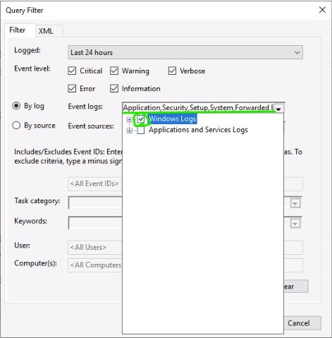
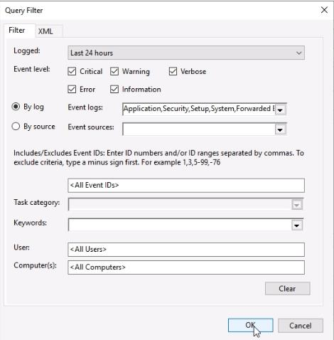
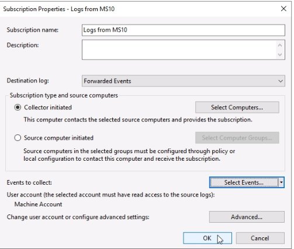
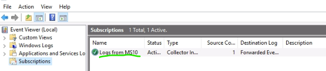
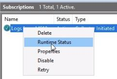
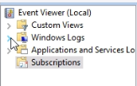
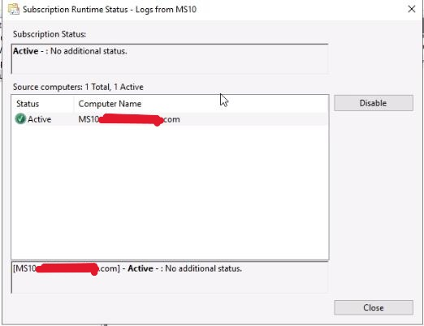
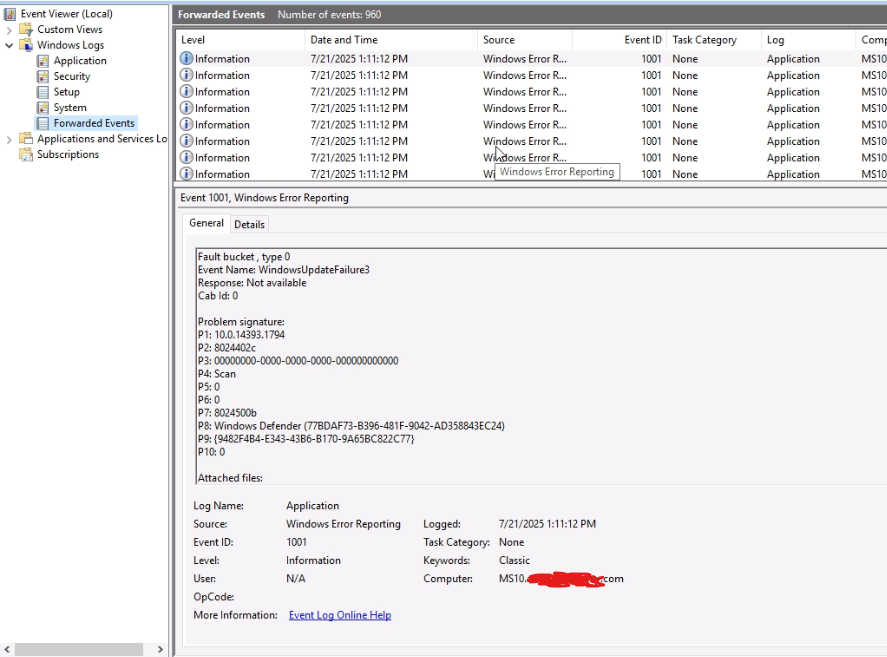
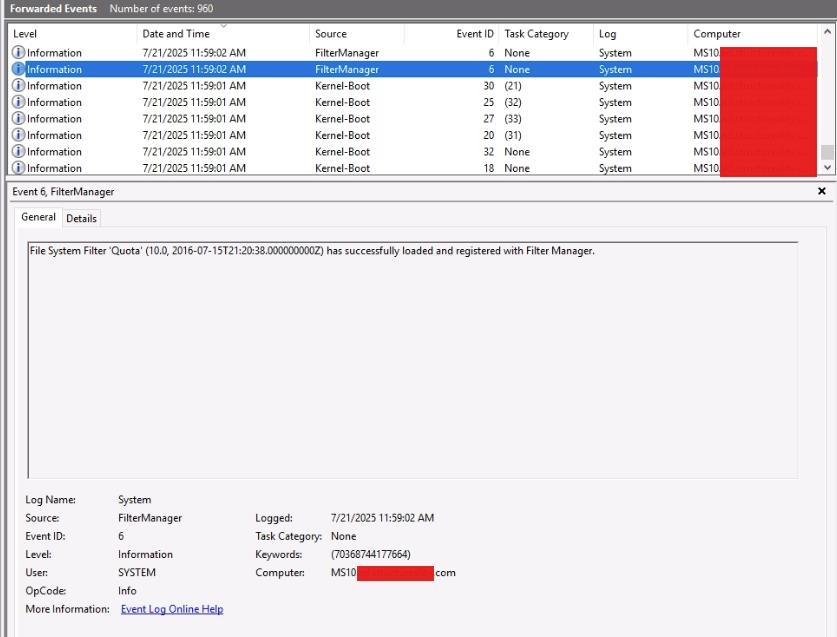


