# Detecting and Responding to Malware

In this lab, we will learn about analyzing files that may be malicious. 

As a security team member, you are working to improve your organization's security stance. This lab focuses on the tools and services that can assist you in determining if a file is benign, suspicious, or possibly malicious. In this lab, you will explore the services of Joe Sandbox Cloud. Finally, you will perform malware investigation via URL and hash submission at VirusTotal.

## Understand the environment

You will be working from a virtual machine named KALI hosting Kali Linux.

## Objectives
- Check hashes/URLs against public reputation.
- Review dynamic analysis safely in a sandbox.
- Record indicators and ATT&CK mappings.
- Analyse indicators of malicious activity. 

## Tools & Techniques
- Online sandbox (read‑only review)
- Multi‑engine reputation portal
- Hashing utility (`Get-FileHash`, `sha256sum`)

## Table of Contents
- [1) Explore Joe sandbox cloud](#1-Explore-Joe-sandbox-cloud)
- [2) File analysis with VirusTotal](#2-File-analysis-with-VirusTotal)

---

## 1) Explore Joe sandbox cloud 

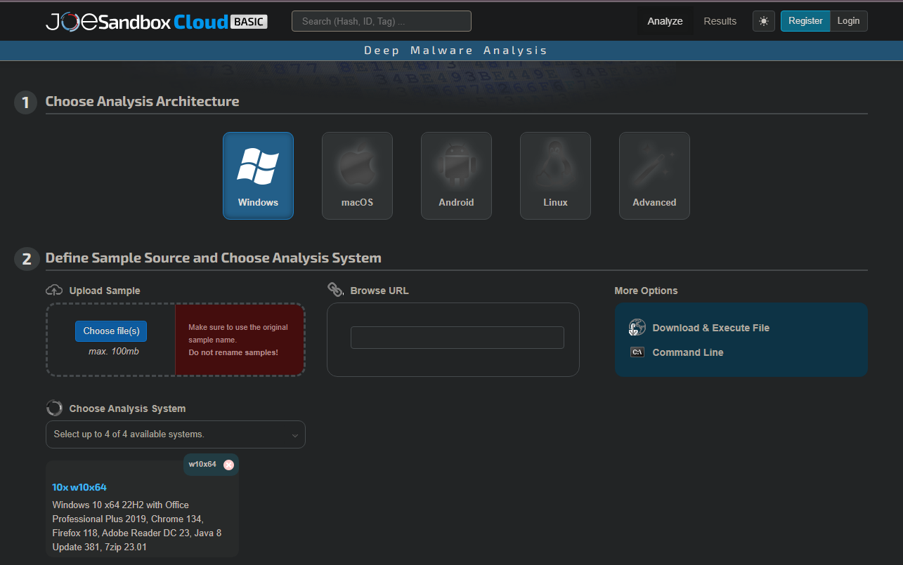
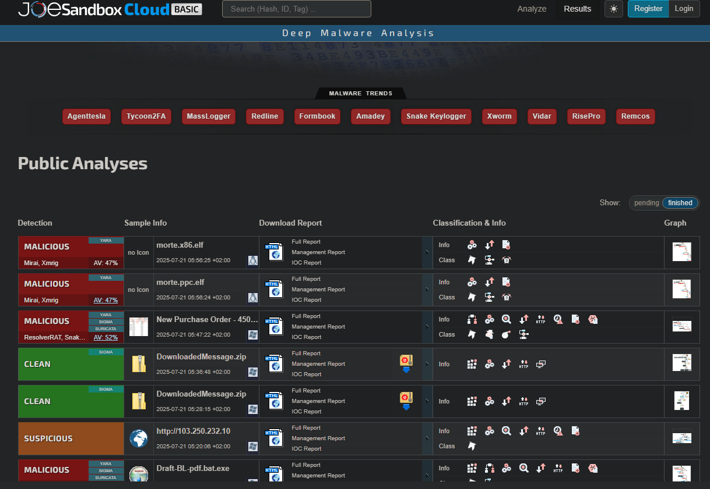
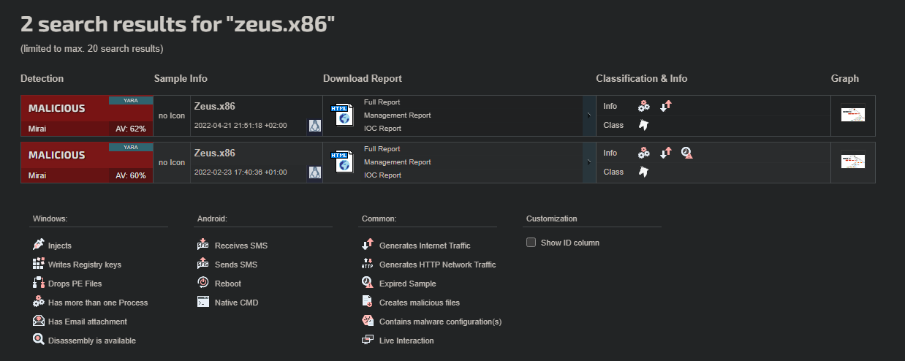
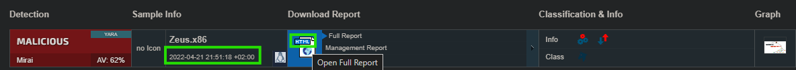
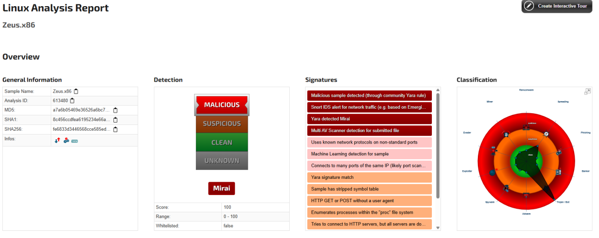

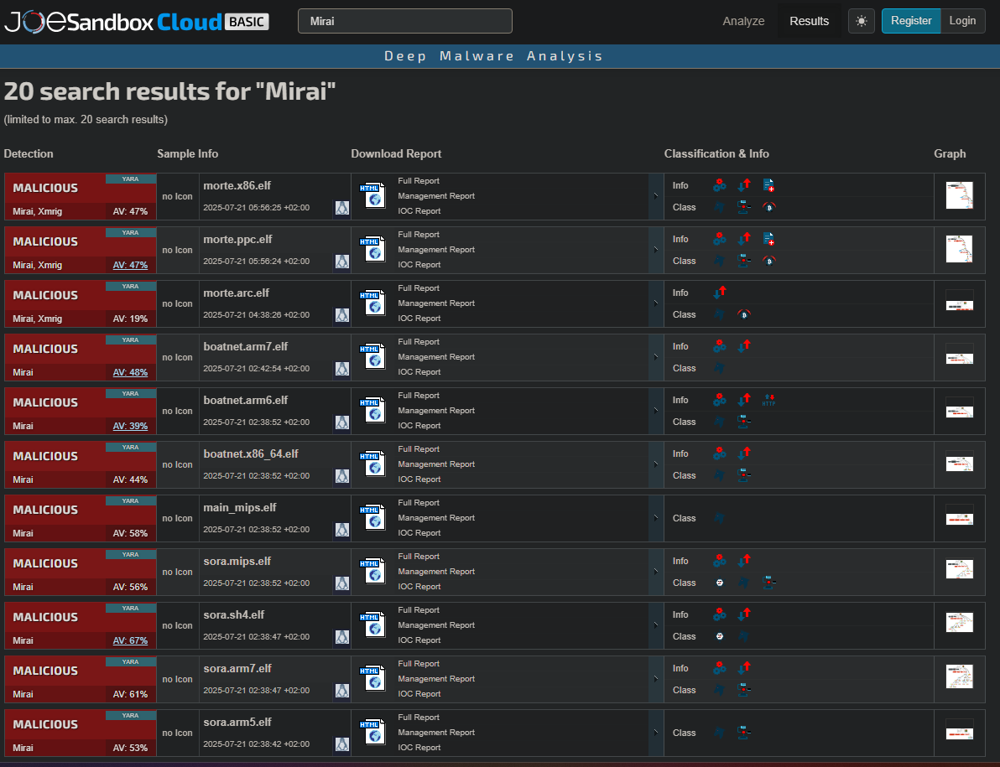
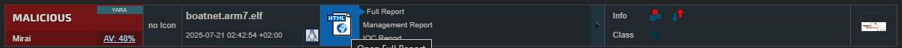
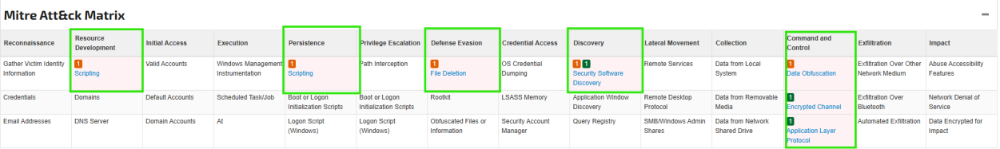
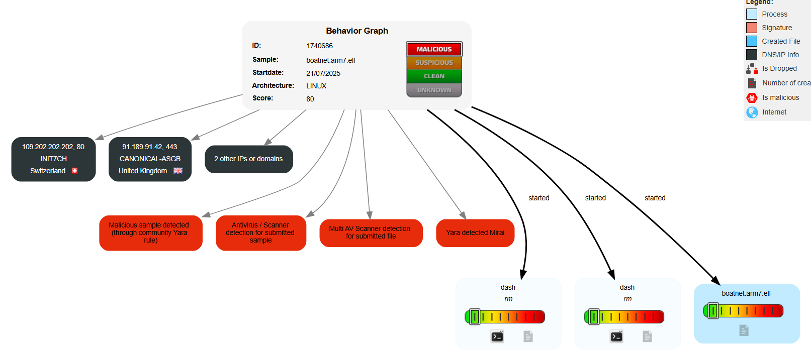
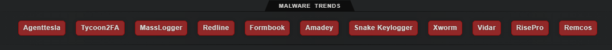

## 2) File analysis with VirusTotal 

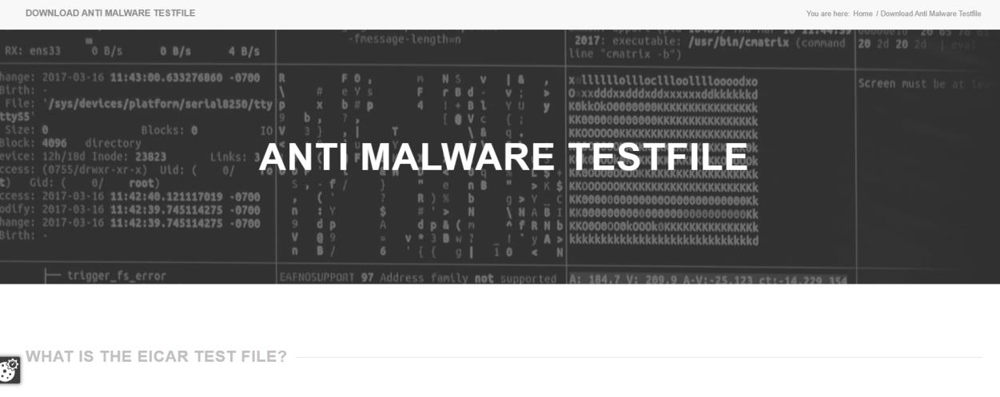
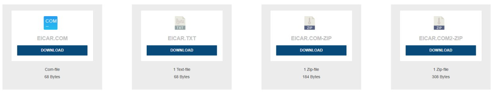

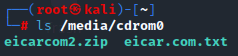
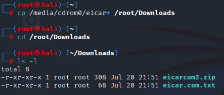
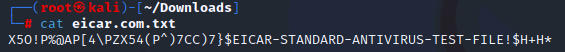
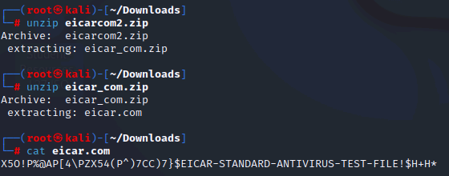

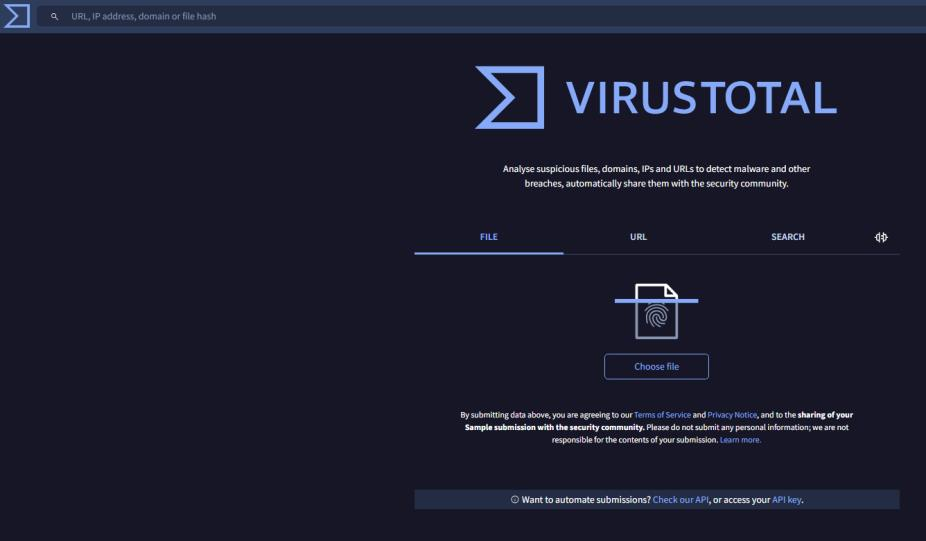
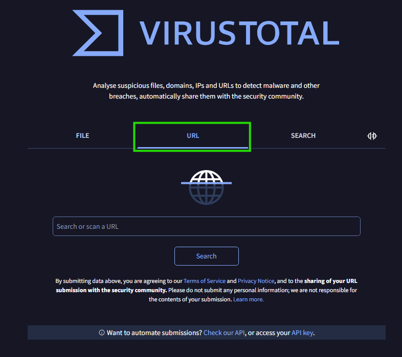
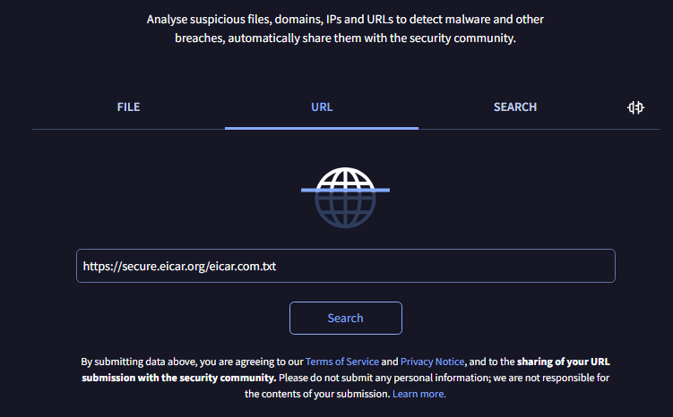
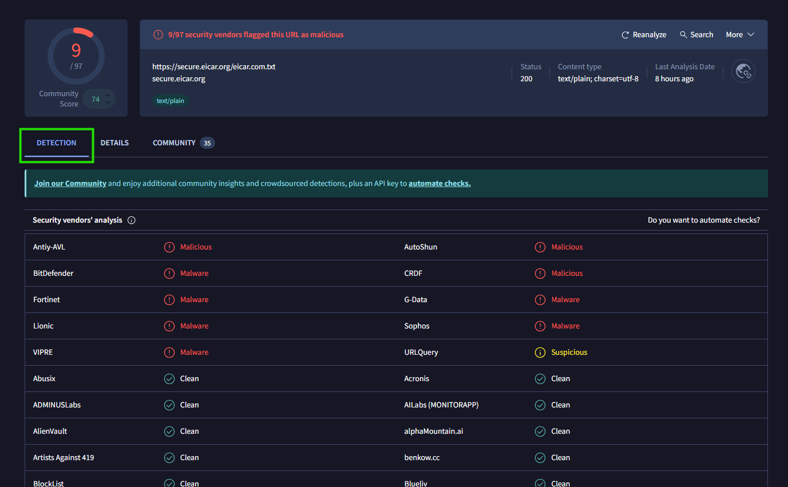
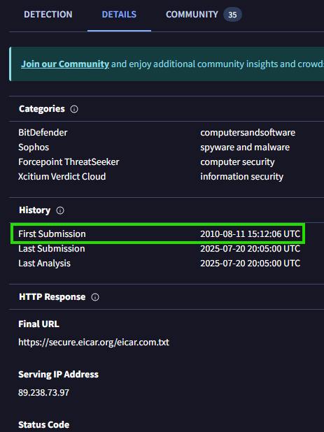
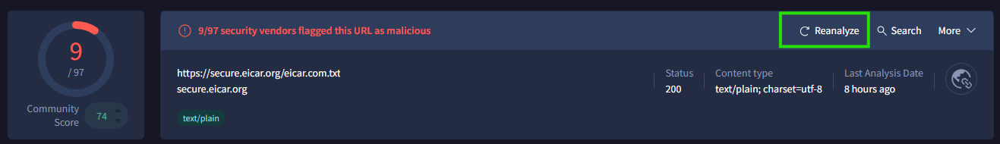
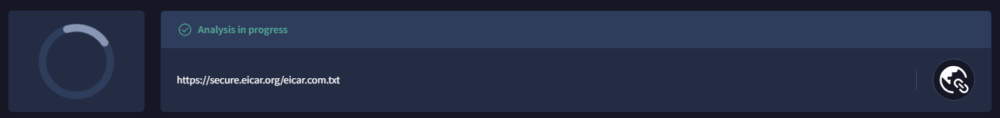

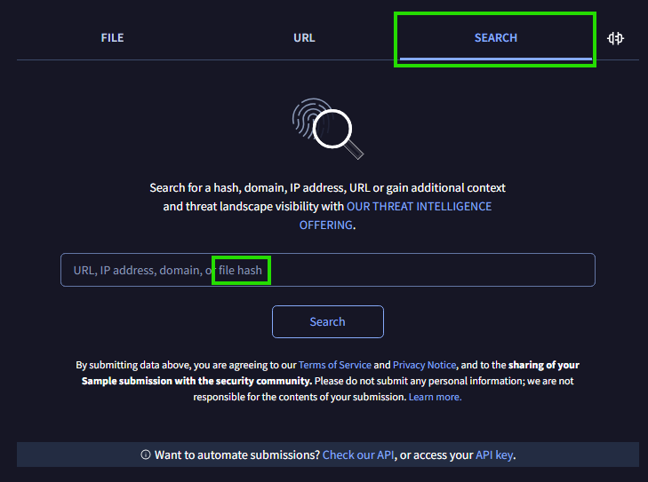
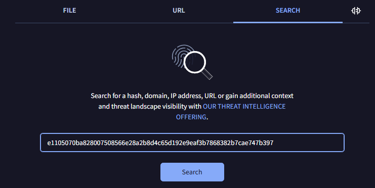
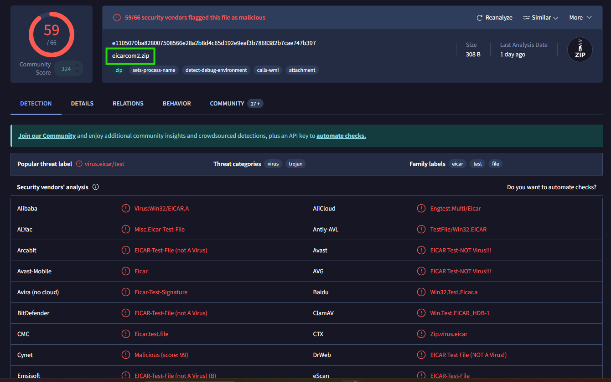
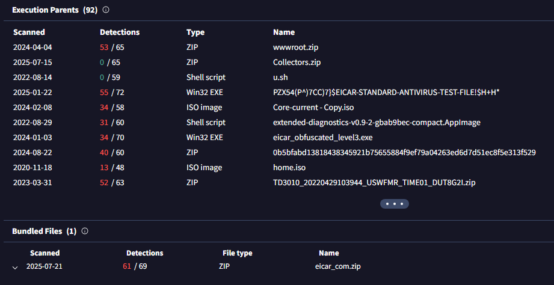
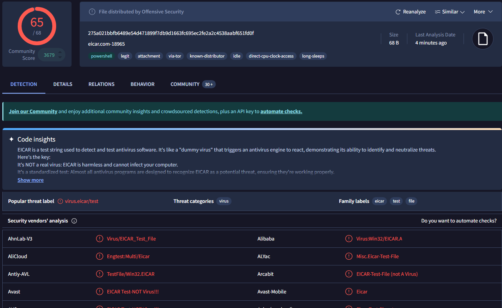
