# Incident Response & Detection

In this case, we will learn about using an automated security platform, wazuh, to detect IoCs related to suspicious activity. This demonstrates the detection phase of an Incident Response Plan. 

As a security professional, we want to take full advantage of automation to detect and potentially respond to security violations. In this case, we will use wazuh to review security alerts (i.e., detections) related to questionable logon activity. Finally, we will delete audit logs files and then use wazuh to evaluate the detection of this abusive activity. 

the security workstation this work is going to be done in Kali Linux, is in server subnet. we will access the wazuh web interface from Kali and DC10 while performing attack simulations from Kali and DC10 against DC10. 

## Understand the environment

we will be working from a virtual machine named KALI hosting Kali Linux. This system is security workstation and is in server subnet. we will use a virtual machine named WAZUH running Ubuntu Server and supporting the wazuh security platform. we will be accessing the wazuh web interface from Kali. we will also be using a virtual machine named DC10 hosting Windows Server 2019, where we will perform attack simulations on and against.

## Objectives
- Generate realistic auth activity for baseline
- Detect failures followed by a success from the same source
- Pivot by agent and rule ID to confirm scope
- apply security principles to secure enterprise infrastructure.
- Explaining security alerting and monitoring concepts and tools.
- modify enterprise capabilities to enhance security.
- use data sources to support an investigation. 

## Table of Contents
- [1) Detecting logon events with wazuh](#1-Detecting-logon-events-with-wazuh)
- [2) Detecting anti-forensics with wazuh](#2-Detecting-anti-forensics-with-wazuh)


---

## 1) Detecting logon events with wazuh

Wazuh is an open-source security platform built on OSSEC, providing a range of features for monitoring, threat detection, and compliance management. Key features include log analysis, file integrity monitoring, vulnerability detection, intrusion detection, configuration assessment, and incident response. Wazuh can be integrated with other security tools like the Elastic Stack and is highly scalable and suitable for on-premises, cloud, or hybrid deployments. This comprehensive solution helps organizations protect their IT infrastructure, detect potential security threats, and maintain compliance with industry standards and regulations. Effectively, wazuh functions as a SIEM, an IDS, and a SOAR solution all in one. 

The wazuh platform is deployed in this environment on an Ubuntu server VM named wazuh. This system takes a few minutes to become fully active due to the significant number of components that must be loaded and activated by the wazuh platform. Thus, to give the system time to finish loading, we will perform attack preparation steps before accessing wazuh. 

The name of the primary security tool in use is wazuh, which only uses lowercase letters. So, other than when this name appears as the first word of a sentence, it will be in lowercase as its' developers intended. 

IoC (Indicator of Compromise) detection and analysis is the process of identifying, collecting, and analyzing signs of potential security breaches or malicious activities within an IT infrastructure. Indicators of Compromise are artifacts or pieces of information that suggest an intrusion, malware infection, or other security incidents. These specific details are also known as observables. IoCs help security teams detect threats, investigate incidents, and respond effectively to minimize the impact of potential breaches. While IoC detection and analysis can be accomplished manually, it is often essential to use automation to maintain relentless oversight of an enterprise network environment. 

In this case, we will be using wazuh to detect IoC (Indicators of Compromise) related to logon events. we will perform two types of login attacks, then view the security alerts caused by those attacks in wazuh. 

Connect to the KALI virtual machine and sign in as root


Open a Terminal window and then maximize the Terminal window.

On the Kali Linux toolbar (located at the top of the screen by default), select the **Terminal Emulator**. This icon looks like a black computer screen with a cursor. 


The window that opens is the Terminal window. It will have a prompt of root@kali. 

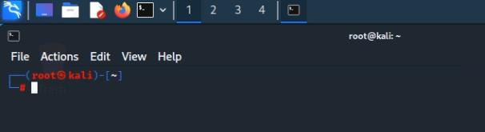

Select the Maximize button on the Terminal window located to the far-right on the header.  

Create /root/passlist.txt by adding Pa$$w0rd into the 57th line position of the /usr/share/seclists/Passwords/500-worst-passwords.txt file. Then, confirm the addition of this lab password. 

Enter the following: 
```bash
sed '57i\Pa$$w0rd' /usr/share/seclists/Passwords/500-worst-passwords.txt > passlist.txt
```
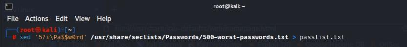

The passlist.txt is modified in this command in order to allow for a successful password-guessing attack.

Enter ls -l to confirm the passlist.txt is present in the current directory (which should be /root). 
```bash
ls -l
```
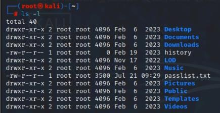

Enter the following: 
```bash
grep -n 'Pa$$w0rd' passlist.txt
```
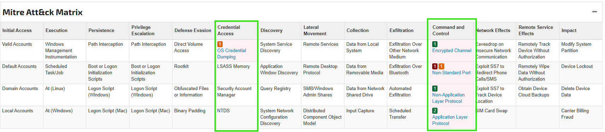

The output should be: 57:Pa$$w0rd. This confirms that the password was added to this password list file in the proper position.

Access the wazuh platform at 10.1.16.242 using a web browser and log in as **admin**

**Note** If an "Warning: Potential Security Risk Ahead" page is displayed when attempting to access 10.1.16.242, select **Advanced**, scroll down, and then select **Accept the Risk and Continue**. 

Open Firefox by selecting its icon from the taskbar. 

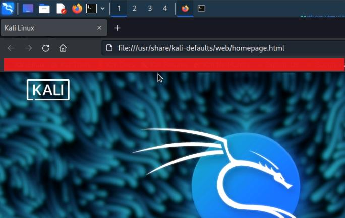

In the Firefox address bar, enter: 
```numb
10.1.16.242
```
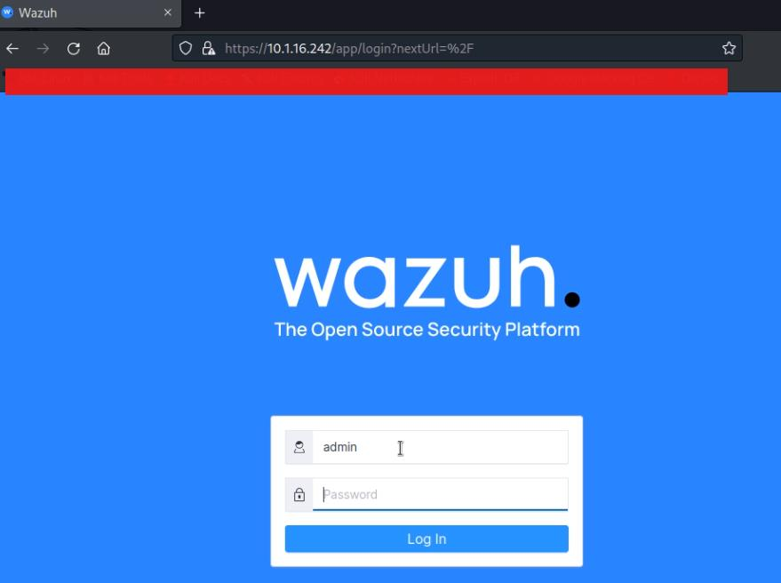

If the wazuh log in page is not displayed, wait a few moments, then refresh the page. 

If you see the message Wazuh dashboard server is not ready yet, then wait several seconds, then refresh the page. 

Once the log in fields are presented, type **admin** in the Username field, type the Password, and then select **Log In**.

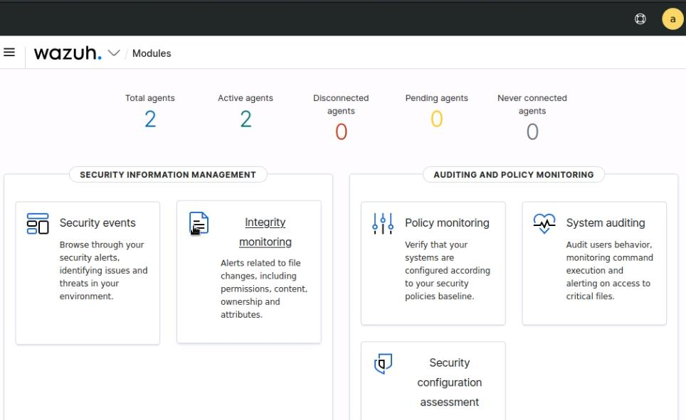

A presentation of service activation progress may be displayed. This can take up to a minute to complete.

The wazuh home screen should be displayed. 

If you leave the wazuh interface idle for too long (typically 10 mins or more), the session will timeout. However, the currently displayed screen will not change, but the session will have ended. When you attempt to select another feature or function from the wazuh interface, you will be prompted to log in again.  

View the **Security events** for only the **DC10** system. 

Select **Security events** from the Security Information Management section of the wazuh home page. 

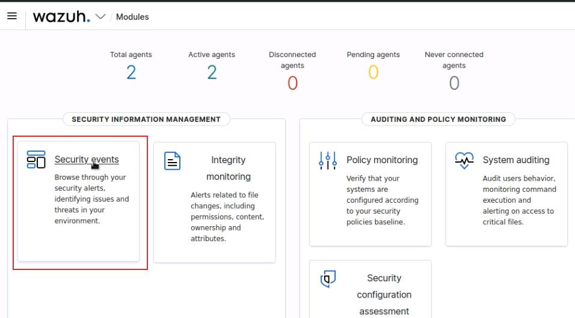

The wazuh Security events presentation is an amalgamation of the data pulled from all systems where a wazuh agent is installed. In this case, there is an agent on DC10 and PC10.

Select **Explore agent** near the top of the page. 


On the Explore agent pop-up window, select **DC10**.

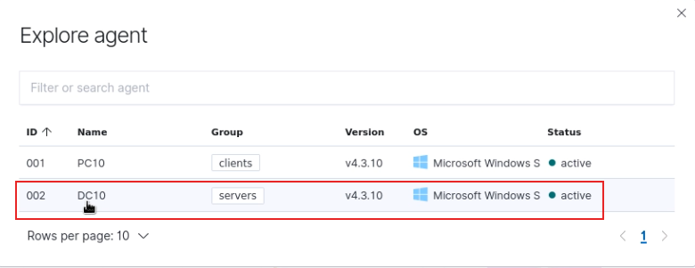

The DC10 (001) agent identifier should be displayed in the location where the Explore agent link was previously.


If needed, you can clear the agent focus setting by selecting the push-pin image to the right of the DC10 (001) agent name.

The PC10 system is also configured with a wazuh agent. But that agent and VM are not used in this case. 

Scroll down the Security events page to view the currently available information. 

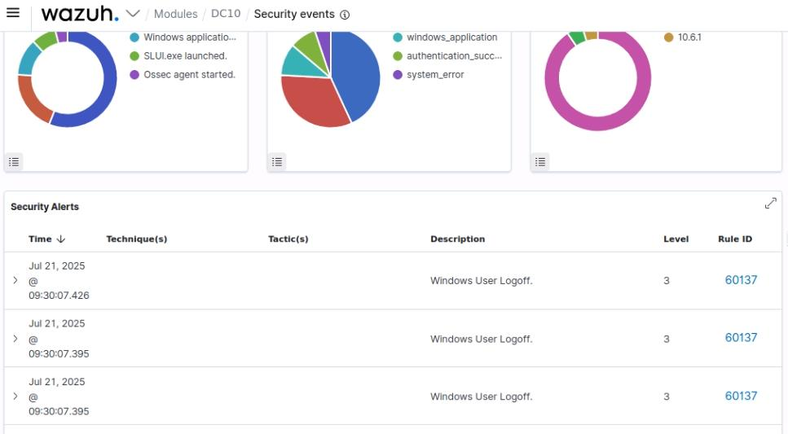

Since the monitored system of DC10 has only been running for a few minutes, there will be only minimal information.

Notice that the timer interval is set to Last 24 hours by default. This is sufficient for this task and all of the wazuh work. 

Most of the information on the Security events page is clickable to view more information or implement filters. 

Scroll back to the top of the Security events page. Look at the counter of Total, then select **Refresh** to update the presentation with any new events. You may see the Total counter increment, which indicates new events occurred on the monitored systems that have been evaluated by wazuh. 

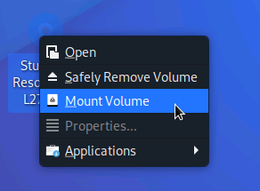

Windows is a very noisy and busy operating system. This is further exacerbated by the DC10 system being a domain controller. There are myriad tasks performed automatically by the OS and Active Directory, which involve launching tasks or services which trigger logon and logoff events. These and other common management events will populate the log files of DC10 and be evaluated by wazuh. we will perform specific actions to simulate suspicious or malicious events and then see what wazuh detected about those events. 

Leave the browser open to wazuh. 

From the Terminal window, we will use **hydra** to perform a password guessing attack, using the **passlist.txt** modified previously, via the RDP (Remote Desktop Protocol) service against the administrator account on DC10 (**10.1.16.1**). 

Return to the Terminal window opened previously 

Enter the following to perform a password guessing/stuffing attack against the administrator account on DC10 (10.1.16.1) while attempting to access the RDP service: 
```bash
hydra -t 1 -V -f -l administrator -P passlist.txt rdp://10.1.16.1 
```
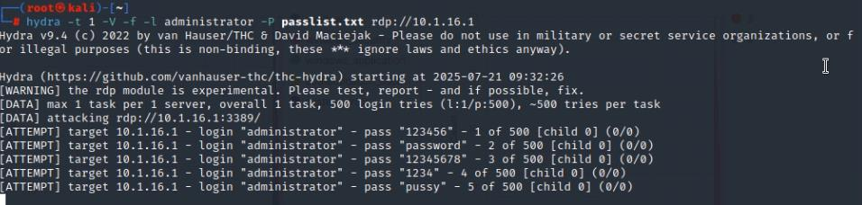
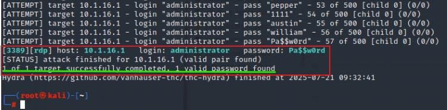

This command will perform the password-guessing attack against the target. You should see 57 attempts, with the 57th attempt succeeding. Hydra terminates once a successful password guess occurs. 

Switch back to the browser displaying wazuh. 

View the security alert(s) resulting from the password guessing attack. Find the entry of Rule ID 92652 for the successful password discovery. 

Select **Refresh** at the top of the page to update the display with new information obtained by the wazuh agent on DC10. 

The Total counter should increase by at least 57, and you should see incremented Authentication failure and Authentication success counters. 

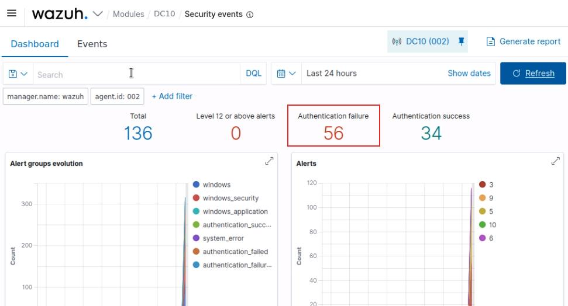

Type **92652** into the Search field near the top of the page, then select **Update**.


You may have to select **Refresh** a second time for the results to actually update based on your search term. (Note: the Refresh button changes to the Update button when you type something into the search field.) 

Scroll down below the graphs to view the list of Security Alerts. 

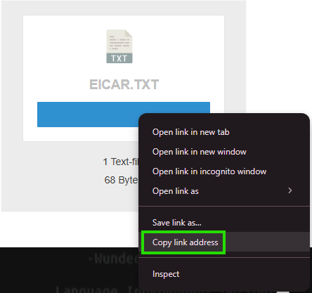

The result should be a page with a very low Total count (likely 1 (unless you ran the hydra attack multiple times)), and the Security alert list should only have one or very few rows.

Select the first item you can locate in Security alert list with a Rule ID of 92652. 

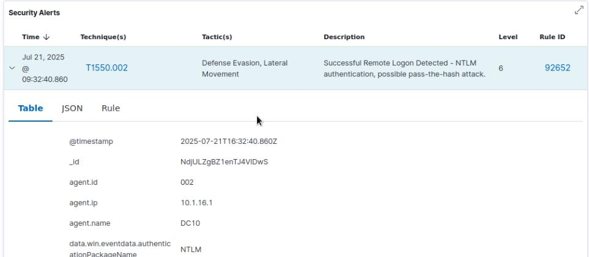

This should expand the Security alert to present you with all of the details. Notice that it contains information pulled from the Windows Event Security log and details related to the wazuh rule. 

Select the same Security Alert row again to collapse the details. 

If you cannot locate the event record, select **Refresh** again from the top of the page. It can take up to a full minute for logged items on the target (i.e., DC10) to be retrieved by the wazuh agent and included in the presentation from the wazuh server. If you still can't find it, try searching the page, type **CTRL+F**, then type **92652**. If this Rule ID is present on the current results page, then it should be automatically highlighted. 

You can increase the number of events shown per page of results at the bottom of the screen. Select **Rows per page: 10**, then select **50 rows** from the pop-up list of options. 

The wazuh platform primarily pulls data from DC10's event logs. Thus, based on the level of logging/auditing configured on the source, wazuh may not obtain sufficient information to detect the broadest range of threats. The wazuh platform is not limited to Windows event logs, as it can also pull in application logs, network device logs, logs from other OSes (such as Unix and Linux), and even cloud service logs. The more broadly these various systems, services, and devices collect logs; the more wazuh can obtain and analyze the details of the related events. 

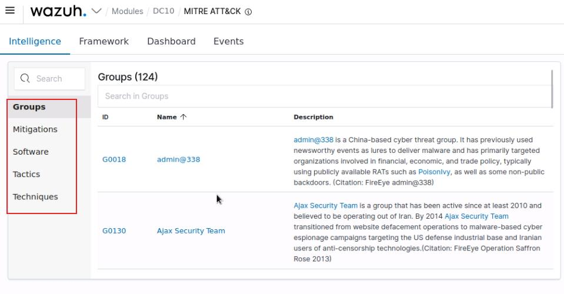

Notice that the wazuh Security events page presents a range of interesting information for each listed event, including Technique(s), Tactic(s), Description, and Level. 

<details>
<summary>Column details:</summary>

<details>
<summary>Techniques</summary>
 This column provides a reference code as a click-link to more information about the potential techniques used in the attack or detected activity. This can include details about attack vectors, tactics, and any known attack patterns or signatures. This column aims to offer insights into the nature of the event and the attacker's methodology or intent. Wazuh uses the MITRE ATT&CK framework to categorize and describe the techniques used in detected events. This framework is a globally accessible knowledge base of adversary tactics and techniques based on real-world observations. By leveraging the MITRE ATT&CK framework, Wazuh can provide more contextual information about the threats and help administrators understand the attacker's objectives, tactics, and techniques, leading to more effective incident response and threat mitigation.
</details>

<details>
<summary>Tactics</summary> 
  A higher-level category that groups related techniques, representing the attacker's overall objectives or goals. This column aims to offer insights into the overall objectives or goals of the attacker, giving context to the techniques used in the event. By providing this context, wazuh enables more effective incident response, threat management, and mitigation strategies. 
</details>

<details>
<summary>Description</summary>
  This information is defined by the wazuh rule, which matches the event from the source's logs. It is a description of or a prediction of the type of event that occurred. 
</details>

<details>
<summary>Level</summary> 
  The wazuh security event Level, also known as the alert level, is a numerical value assigned to each security event or alert generated by the wazuh platform. The alert level is designed to indicate the severity or importance of the event, helping administrators prioritize their responses and focus on the most critical issues. 
  </details>
</details>

<details>
<summary>Wazuh uses a scale from 0 to 16 for its alert levels, with 0 being the least severe and 16 being the most severe. The alert levels are typically categorized as follows:</summary> 

<details>
  <summary>Informational (0-3):</summary>
  These alerts indicate routine events or general information about the system or application and usually do not require immediate action.
  </details>

<details>
<summary>Low severity (4-7):</summary> 
  These alerts indicate minor security issues, non-critical system events, or policy violations that should be investigated but may not require immediate action. 
 </details>

<details>
<summary>Medium severity (8-11):</summary>  
  These alerts indicate more significant security issues, potential breaches, or critical system events that should be addressed promptly. 
   </details>

<details>
<summary>High severity (12-15):</summary>  
  These alerts indicate severe security issues, active breaches, or critical system failures that require immediate attention and action. 
   </details>

<details>
<summary>Emergency (16):</summary>  
  These alerts represent the most severe and urgent security events, indicating an active or imminent threat to the system or infrastructure. 
   </details>
</details>

Alert levels can be customized based on an organization's specific requirements, allowing administrators to fine-tune the priority and response to different types of security events. Wazuh's flexible alert management system helps organizations effectively manage their security monitoring and incident response efforts. 

View the Technique information related to Rule ID 92652. 

Select **T1550.002** from the first Security Alerts row of an entry with Rule ID 92652. 

A Details page about the Pass the Hash technique is displayed. 

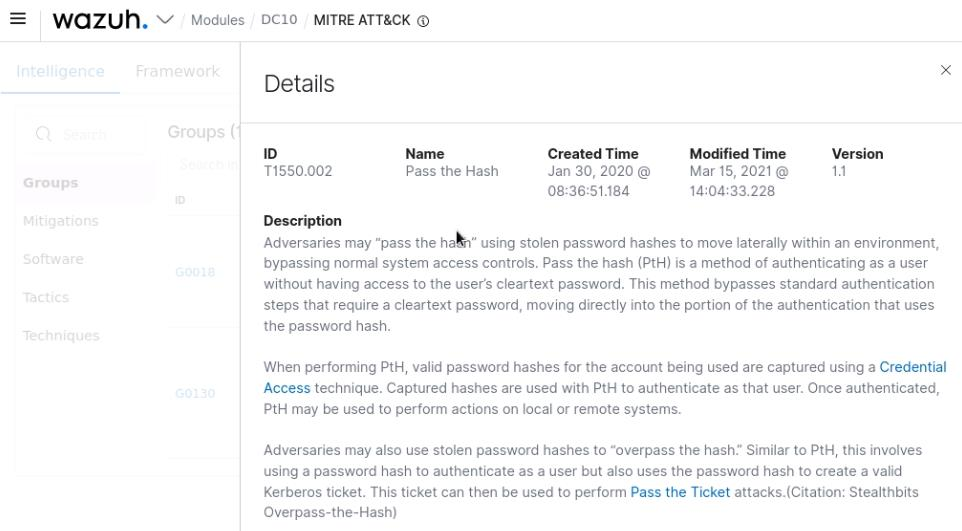

**Quick Quiz**

<details>
  <summary><strong>Review the information about this attack technique. What is the MITRE ATT&CK technique associated with the event with Rule ID 92652?</strong></summary>

<details><summary>Pass the Ticket (T1550.003)</summary>❌ Incorrect</details>

<details><summary>Kerberoasting (T1558.003)</summary>❌ Incorrect</details>

<details><summary>Brute Force (T1110)</summary>❌ Incorrect</details>

<details><summary>Valid Accounts (T1078)</summary>❌ Incorrect</details>

<details><summary>Pass the Hash (T1550.002)</summary>✅ Correct — Rule 92652 alerts on successful NTLM logon activity consistent with Pass-the-Hash.</details>
</details>

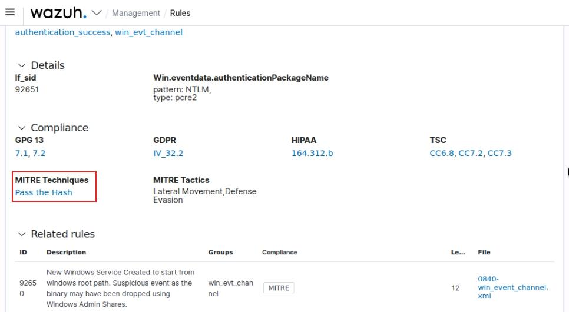

The technique associated with this event is inaccurate. While it is true that a pass the hash attack (PtH) could have been the cause of the event recorded into the Windows security log, you know that is not the attack you performed. You ran a password-guessing attack using a dictionary list, which is not the same attack concept as PtH. A PtH attack requires the theft of an access token from a valid client, which is then used from a different system to fool the authentication service. 

The Technique(s), Tactic(s), Description, and Level columns of the wazuh Security Alerts are not always accurate. You would need to look at the raw data from the logs to confirm what actually took place. You can create your own rules to process log entries differently than the default rules. This lab uses only the default wazuh rule set. 

The wazuh interface can be challenging to navigate. You mostly can only move forward through content, as using the back toolbar button does not do anything. If you navigate away from a search result list or interface page, you often need to return to the wazuh home page and re-navigate to the desired page or location. This also means your search will be discarded, although filters are usually more resilient. 

Find the entries of Rule ID 60122 for the failed password discovery attempt records. 

Select the **wazuh** homepage, and then select **Security Events** in the Security information management section to return to the top of the wazuh Security events page. 


Change the search value from **92652** to **60122**, then select **Update**.

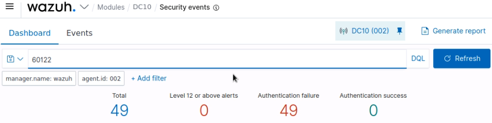

There should be numerous results of Logon failure - Unkown user or bad password. 

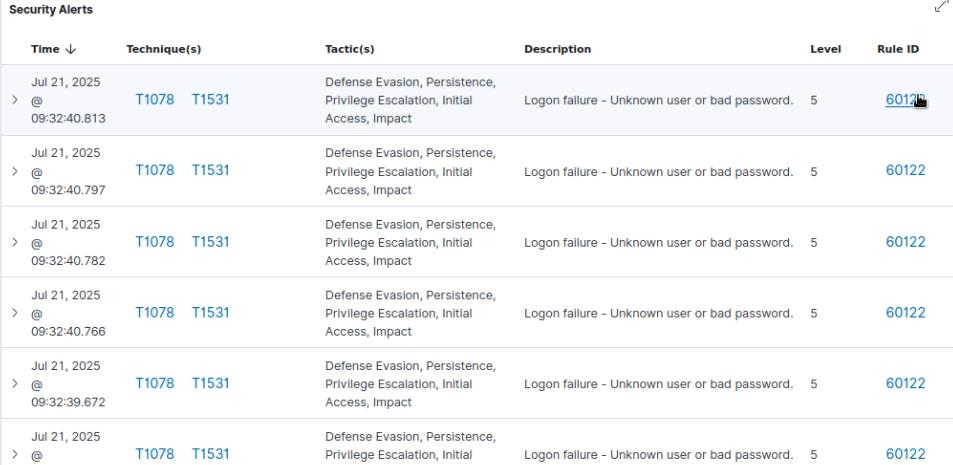

<details>
<summary><strong>A Wazuh rule is a set of conditions and criteria used to identify and classify security events, generate alerts, and trigger actions in response to specific patterns or activities. Wazuh rules are written in XML format and are essential to the platform's intrusion detection, log analysis, and compliance monitoring capabilities. The main components of a Wazuh rule include:</strong></summary>
  
---

Rule ID: A unique identifier for the rule, which is used to reference the rule in logs, alerts, and other rules. 

---

Description: A brief summary of the rule's purpose, explaining what it is designed to detect or monitor. 

---

Level: The severity or importance of the event detected by the rule, represented as an alert level on a scale of 0 to 16. 

---

Groups: One or more group names that categorize the rule, making it easier to manage and filter related rules. 

---

Frequency: The number of events matching the rule's conditions that must occur within a specified time window before an alert is generated (used in combination with timeframe). 

---

Timeframe: The time window (in seconds) within which a specified number of events matching the rule's conditions must occur to generate an alert (used in combination with frequency).

---

Match: The pattern or expression that the rule looks for in the log data, typically defined using regular expressions or other pattern-matching techniques. 

---

Decoders: The decoder(s) associated with the rule, which are responsible for extracting relevant information from log data and normalizing it for further analysis. 

---

Options: Additional settings or modifiers that affect the rule's behavior, such as noalert (which prevents alerts from being generated) or ignore (which tells Wazuh to disregard certain events). 

---

Mitre ATT&CK ID: The unique identifier(s) for the MITRE ATT&CK technique(s) or tactic(s) associated with the rule, providing context for the detected event and helping security teams understand the attacker's methodology and intent. 
</details>

---

These components define the conditions under which a rule is triggered and the actions taken when an event matches the rule. Wazuh's flexible rule system allows organizations to create custom rules tailored to their specific needs, enhancing their security monitoring, threat detection, and compliance management capabilities. 

Delete the **60122** value from the wazuh Search field, then select **Update**.

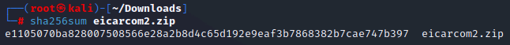

From the Terminal window, attempt to mount the **C$** share using the **Jaime** account and **Pa$$w0rd** as the password. 

Return to the Terminal window. 

To create a mount point Enter: 
```bash
mkdir /mnt/dc10-c 
```
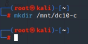

Enter the following and provide **Pa$$w0rd** as the password when prompted.
```bash
mount -o username=jaime //10.1.16.1/c$ /mnt/dc10-c
```
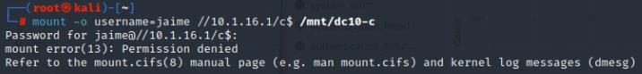

This mount attempt will fail.

Attempt to mount the **C$** share using the **administrator** account and **Pa$$w0rd** as the password.

Return to the Terminal window. 

Enter the following and provide **Pa$$w0rd** as the password when prompted.
```bash
mount -o username=administrator //10.1.16.1/c$ /mnt/dc10-c
```
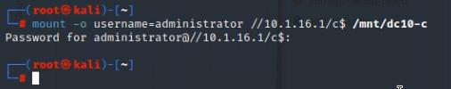

This mount attempt will succeed. 

Switch back to the web browser focused on wazuh. 

Locate the Security events caused by the mount attempts. 

Note The Rule ID for a logon failure is 60122. The Rule ID for a logon success is 60106. 

Select **Refresh** to update the wazuh Security events page with the latest data. 

Enter **60122** in the Search field, then select **Update**.


Scroll down to view the alert record(s).

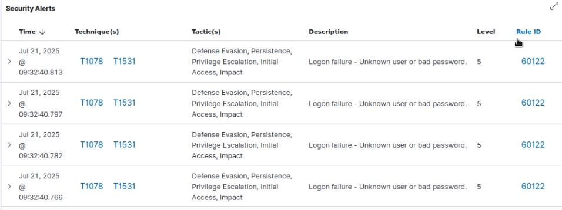

Select an alert record to expand it. After reviewing the details, select it again to collapse it.

Scroll back up to the top of the page. 

Enter **60106** in the Search field, then select **Update**.

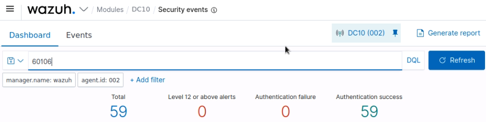

Scroll down to view the alert record(s). 

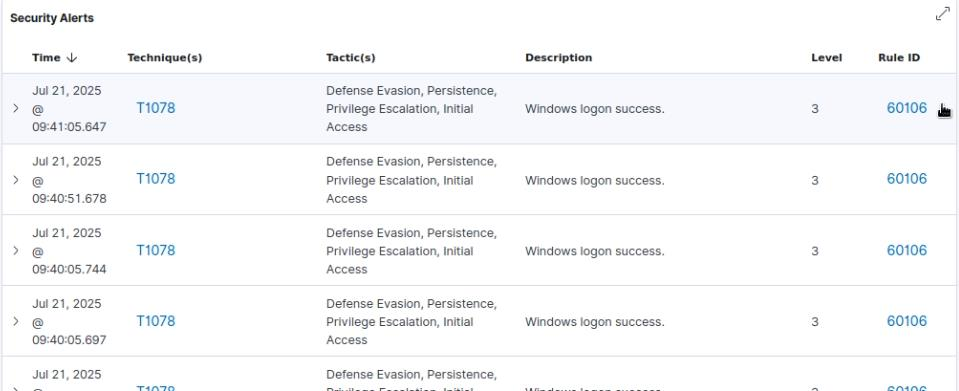

Select an alert record to expand it. After reviewing the details, select it again to collapse it. 

Quick Quiz

<details>
  <summary><strong>Select an alert record to expand it. After reviewing the details, select it again to collapse it.<br>What are the Technique(s) reference codes for a logon failure event? (Select two)</strong></summary>

<details><summary>T1078</summary>✅ Correct — Valid Accounts (abuse of legitimate credentials). </details>

<details><summary>T5309</summary>❌ Incorrect — not a valid ATT&CK technique ID.</details>

<details><summary>T1531</summary>✅ Correct — Account Access Removal (locking/disabling/changing credentials linked to account access). </details>

<details><summary>T1507</summary>❌ Incorrect — not applicable here.</details>
</details>

Delete the **60122** value from the wazuh Search field, then select **Update**. 

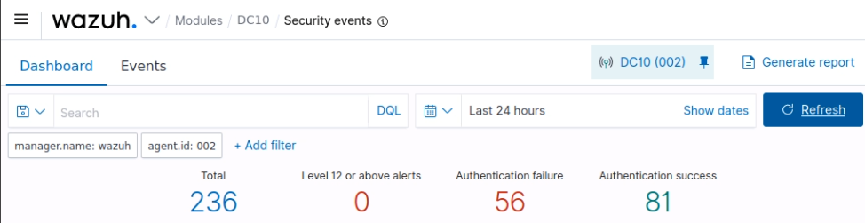

Leave all windows open. 

we have seen wazuh security alerts triggered by matching IoCs to questionable logon activity. The activity of Incident Response Detection is the recording of events into logs, the automated analysis of those logs, and the automated notification of significant incidents to security professionals (if configured). Without detection, i.e., becoming aware of a violating occurrence, it is not possible to initiate Incident Response. 

---

## 2) Detecting anti-forensics with wazuh

Anti-forensics are activities performed by intruders in an attempt to mask, hide, or destroy evidence of their malicious actions on a system. In this case, we will delete log files and view the related security alerts of these IoCs in wazuh. 

Connect to the DC10 virtual machine. Send Ctrl+Alt+Delete and sign in as Administrator using Pa$$w0rd as the password. 

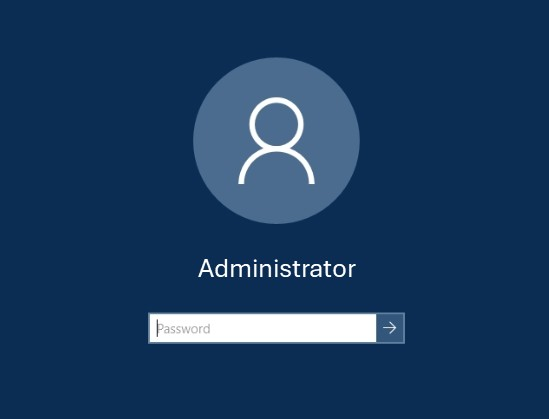

Clear the contents of the Security log. 

Select **Type here to search** from the taskbar, enter **Event** and then select **Event Viewer**. 

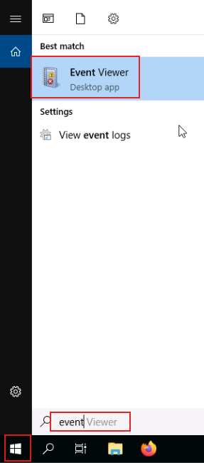

In the left pane, double-click **Windows logs** to expand it.

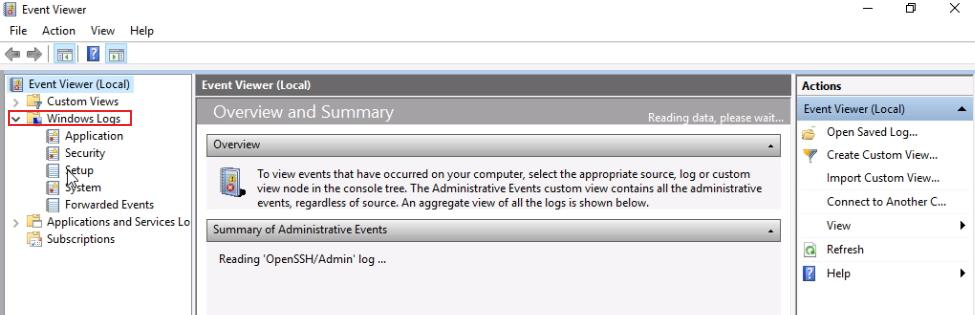

In the expanded list, select **Security**. 

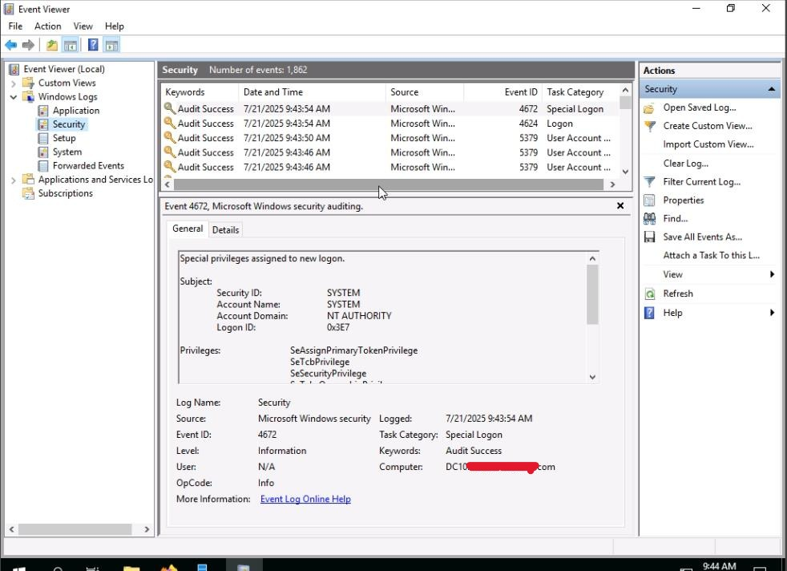

In the right pane, select **Clear log…**.

On the Event Viewer pop-up confirmation window, select **Clear**.

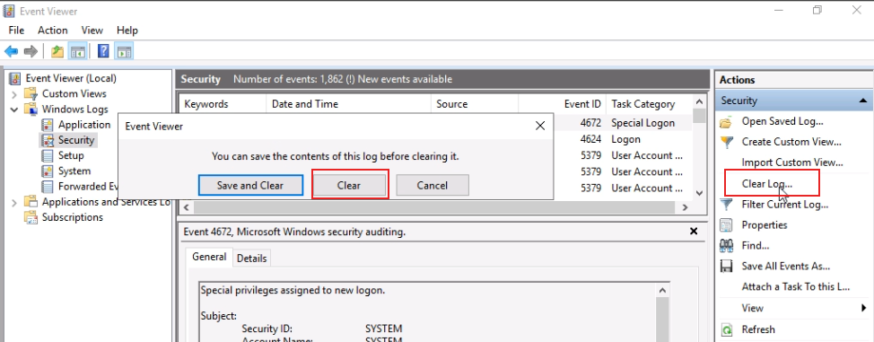

Close the **Event Viewer** 

Connect to the KALI virtual machine and, if needed, sign in as **root**. 

Return to the web browser displaying the wazuh interface. 

Locate the wazuh security alert related to the security log deletion (i.e., 63103). 

Enter **63103** in the Search field, then select **Update**. 

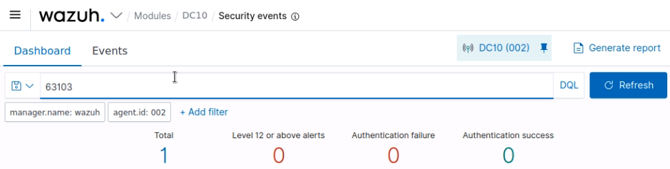

Scroll down to view the alert record(s).

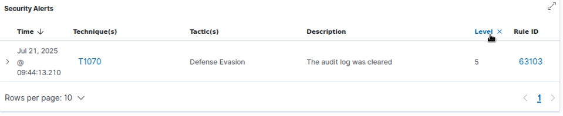

Select an alert record to expand it. After reviewing the details, select it again to collapse it.

Quick Quiz

<details>
  <summary><strong>What is the description for the security alert for the clearing of the Application and System logs?</strong></summary>

<details><summary>The audit log was cleared</summary>❌ Incorrect — that message refers to the **Security** log (Event ID 1102).</details>

<details><summary>A Windows log file was cleared</summary>❌ Incorrect</details>

<details><summary>A log file was cleared</summary>❌ Incorrect</details>

<details><summary>Event viewer logs were cleared</summary>✅ Correct — clearing **Application/System** creates “log cleared” events, commonly surfaced as an alert that Event Viewer logs were cleared.</details>
</details>

You have reviewed the detection of the IoCs of clearing logs of a monitored system through wazuh.

## Key Takeaways
- Correlate failures and success to minimise false positives
- Focus on agent/endpoint pivots for clarity
- Always export artefacts for the case record

## Quick Quiz — Wazuh, ATT&CK & IR Fundamentals

<details>
  <summary><strong>1) What sources can be used by Wazuh to detect suspicious activity? (Select all that apply)</strong></summary>

<details><summary>network equipment logs</summary>✅ Correct — Wazuh ingests network device/syslog data.</details>
<details><summary>application logs</summary>✅ Correct — app logs are collected and analyzed.</details>
<details><summary>cloud logs</summary>✅ Correct — AWS/Azure/GCP logs are supported via integrations.</details>
<details><summary>OS logs</summary>✅ Correct — endpoint/OS logs are a core input.</details>

</details>

---

<details>
  <summary><strong>2) What was the MITRE ATT&amp;CK tactic identified by Wazuh related to the deletion of an audit log?</strong></summary>

<details><summary>Defense Evasion</summary>✅ Correct — clearing Windows event logs (e.g., 1102) maps to ATT&amp;CK Indicator Removal (T1070 / T1070.001).</details>
<details><summary>Privilege Escalation</summary>❌ Incorrect</details>
<details><summary>Persistence</summary>❌ Incorrect</details>
<details><summary>Lateral Movement</summary>❌ Incorrect</details>
</details>

---

<details>
  <summary><strong>3) The phase of an Incident Response Plan that creates a record of events or notifies security personnel about violations is?</strong></summary>

<details><summary>Containment</summary>❌ Incorrect</details>
<details><summary>Analysis</summary>❌ Not the first step that creates/records alerts.</details>
<details><summary>Eradication</summary>❌ Incorrect</details>
<details><summary>Detection</summary>✅ Correct — detection/notification occurs in the Detection &amp; Analysis phase.</details>
</details>

---

<details>
  <summary><strong>4) Once the security team is made aware of a potentially violating incident, what is the next phase in Incident Response?</strong></summary>

<details><summary>Recovery</summary>❌ Incorrect</details>
<details><summary>Lessons learned</summary>❌ Incorrect</details>
<details><summary>Analysis</summary>✅ Correct — after detection/notification, we analyze the event.</details>
<details><summary>Preperation</summary>❌ Incorrect (and spelled “Preparation”).</details>
<details><summary>Eradication</summary>❌ Occurs after analysis/containment planning.</details>
</details>

---

<details>
  <summary><strong>5) Potential signs of security breaches or malicious activities within an IT infrastructure are known as?</strong></summary>

<details><summary>IoCs (Indicators of Compromise)</summary>✅ Correct</details>
<details><summary>Event records</summary>❌ Generic term; not specifically “signs of compromise.”</details>
<details><summary>False positives</summary>❌ Incorrect</details>
<details><summary>Registry values</summary>❌ Too specific; may be an IOC but not the general term.</details>
</details>


