# Using a Playbook

In this blog we will work through a playbook in response to a security incident. 

As a security professional, we may need to step in and perform corrective actions and implement response strategies when automated security systems are offline. In this blog we will work through a playbook focused on resolving potentially malicious code running on an internal system.

## Understanding the environment

we will be working from a virtual machine named PC10, hosting Windows Server 2019, being used as a client. And we will use a virtual machine named KALI, hosting Kali Linux.

## Objectives
- The importance of using appropriate cryptographic solutions. 
- Analyze indicators of malicious activity. 
- Explaining various activities associated with vulnerability management. 
- Explaining security alerting and monitoring concepts and tools. 
- Explaining appropriate incident response activities. 
- using data sources to support an investigation. 
- Summering elements of effective security governance. 

## Tools & Techniques
- Task Manager / Process Explorer
- CLI: `tasklist`, `wmic`, `taskkill`
- PowerShell: `Get-Process`, `Stop-Process`

## Table of Contents

[Setup](#setup)
1. [Playbook Step 1](#playbook-step-1)
2. [Playbook Step 2](#playbook-step-2)
3. [Playbook Step 3](#playbook-step-3)
4. [Playbook Step 4](#playbook-step-4)
5. [Playbook Step 5](#playbook-step-5)
6. [Playbook Step 6](#playbook-step-6)
7. [Playbook Step 7](#playbook-step-7)
8. [Playbook Step 8](#playbook-step-8)
9. [Playbook Step 9](#playbook-step-9)

---

<strong>SIEM, SOAR, and playbooks</strong>
 
The organization's SEIM solution has detected a significant increase in CPU consumption on the PC10 workstation. The level of CPU activity has been at or near 100%, which is abnormal for the PC10 system. Under normal circumstances, the SOAR solution would respond to and resolve the abnormal event automatically. However, the SOAR system is currently offline due to a recent reconfiguration and update failure. Therefore, as a security professional, we will be responding manually to this situation. 

Fortunately, a pre-crafted playbook will us through the manual response activities. An incident response (IR) consulting group wrote the organization's library of playbooks. The IR consulting group was given broad parameters for crafting the playbooks. This has resulted in playbooks with flexibility and support for a wide range of knowledge, skill, and experience levels for those needing to use them to respond to incidents. We will work through the playbook explicitly designed to deal with high CPU consumption by rogue processes. 

A playbook is a checklist of actions to perform to detect and respond to a specific type of incident. 

<details>
<summary><strong>There are several primary steps or phases in this playbook:</strong></summary>

Investigate the high CPU usage and determine the rogue process's name. 

Terminate the offending process. 

Hash the file associated with the rogue process. 

Perform an online malware analysis using the hash value of the suspicious file. 

Determine the owner of the suspicious file. 

Archive the suspicious file into a zip container along with a file of its hash value. 

Copy the zip archive of the suspicious file to a quarantine system. 

Remove the suspicious file from the affected system(s). 

Fill out an incident report and submit it to the SOC for review.
</details>

For each of these steps, there are several options to select from. The playbook steps offer CLI (command line interface) solutions, GUI (graphical user interface) choices, or even third-party utility methods. While most of the operations use native tools, some reference use of tools from third parties.  

The blog is designed so you can choose your own options for each step of the overall playbook procedure. You are welcome to go over the entire blog and make other choices, or you can work through the various choices of each playbook step before moving forward. However, there may be a need to reset the system or implement a work around to use an alternate playbook step choice. These will be defined for you at the end of each playbook step before the Check your work section. 

A playbook is a common example of responsive controls. These are controls that serve to direct corrective actions that need to be enacted after an incident has been confirmed. In a Security Operations Center (SOC), responsive controls might include several very well-defined actions to be taken by a security professional after identifying a specific issue.

Setup

In this introductory exercise, we will log into PC10 and initiate the rogue process. 

This is a necessary step to simulate the persistent execution of a rogue process. 

Connect to the PC10 virtual machine. Sign in as Jaime 


Select **Type here to search** from the taskbar, type powershell, then select **Windows PowerShell** from the results. 

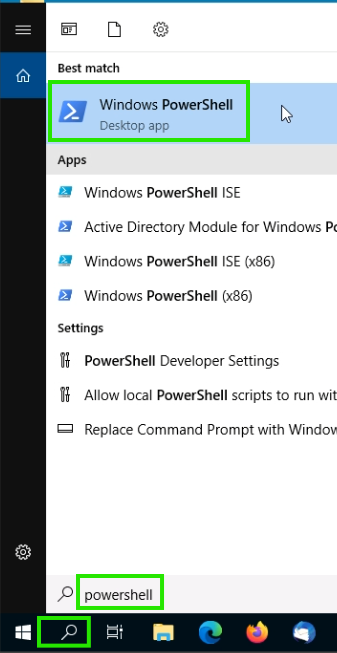

Enter: 
```powershell
C:\LABFILES\Playbook-Lab.ps1
```
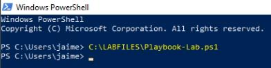

There may be a brief presentation of an empty Windows PowerShell console while the process starts. 

If prompted about allowing an execution exception for the script, type Y, then press Enter. 

Close this Windows PowerShell console. 

**Note** If you fail to close the Windows PowerShell console, the rogue process will be a sub-process of a PowerShell process. 

The rogue process, which is the focus of this lab, should now be running. 

The rogue process will immediately begin to consume most of the CPU. This will cause the system to be sluggish. We should be able to complete the initial playbook steps. 

---

<strong>## Playbook Step 1</strong>

Investigate High CPU usage 

---

## Playbook Step 2

Terminate the offending process 

---

## Playbook Step 3

Hash the suspicious file 

---

## Playbook Step 4

online malware scan

---

## Playbook Step 5

Determine the owner of the suspicious file

---

## Playbook Step 6

Archive the Suspicious File 

---

## Playbook Step 7

Copy the archive to a quarantine system 

---

## Playbook Step 8

Remove the suspicious file from the victim 

---

## Playbook Step 9

Craft a Report about the Response

---


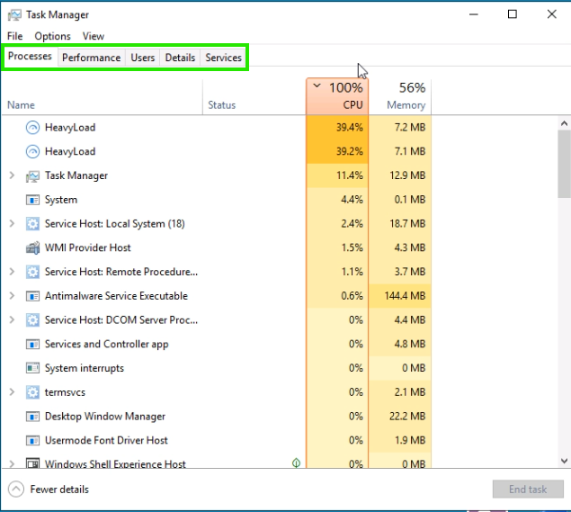
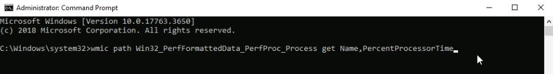
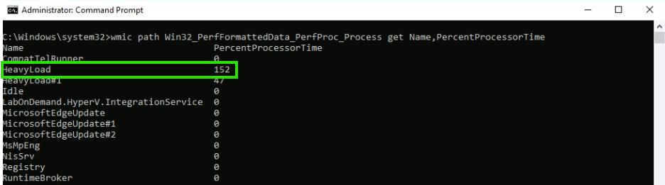
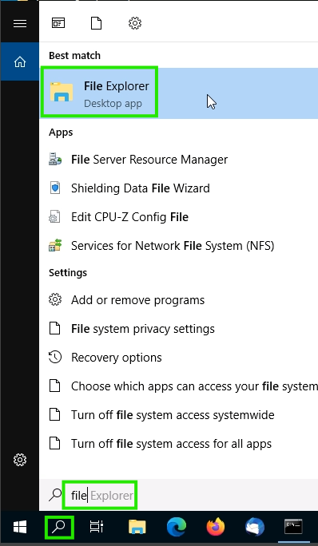
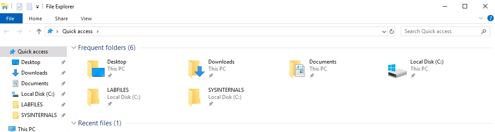
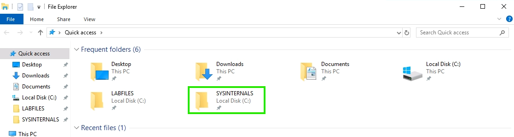
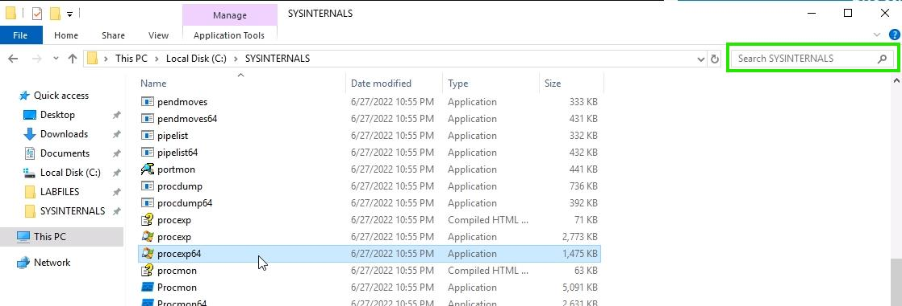
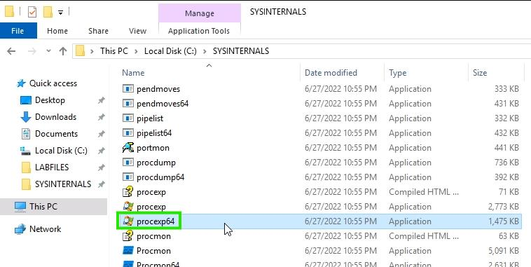
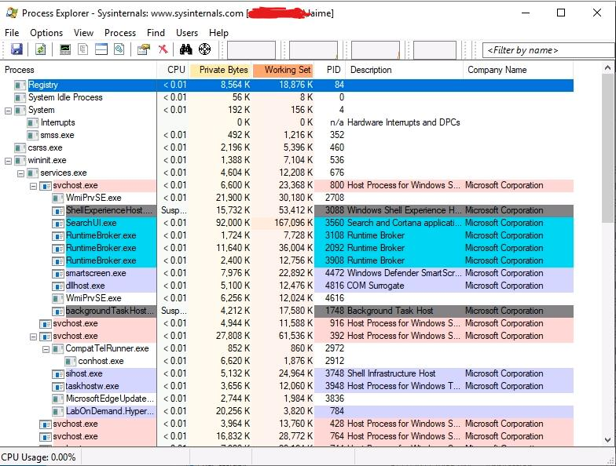
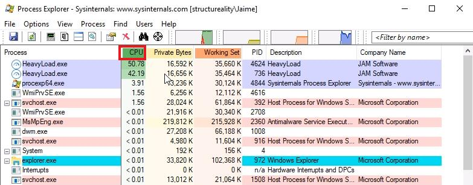
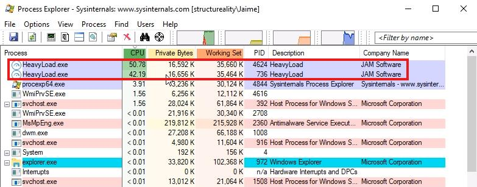
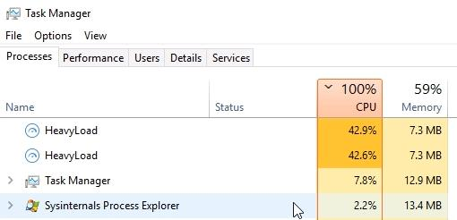
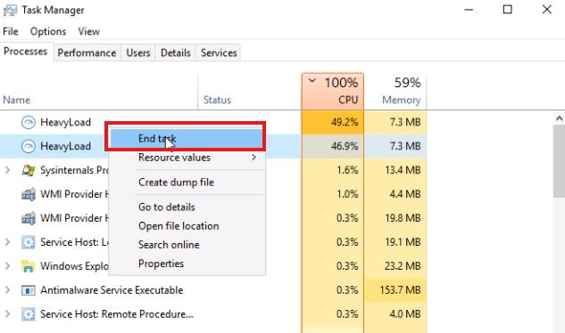
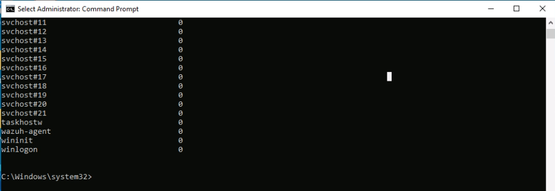
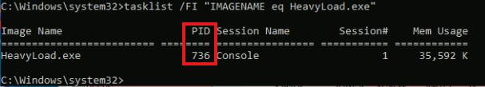
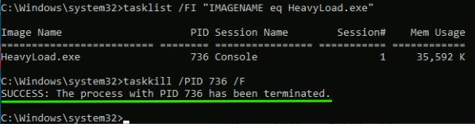
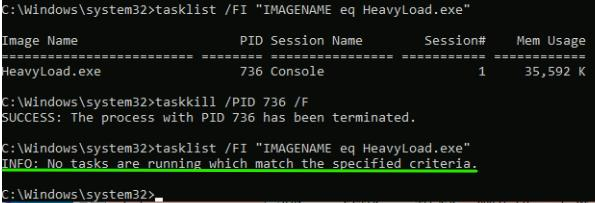
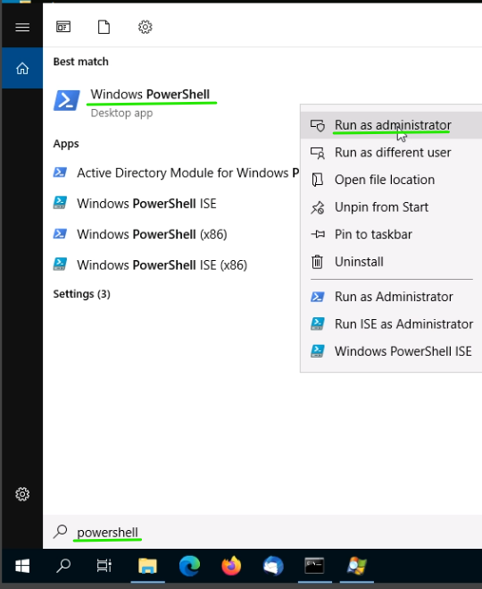
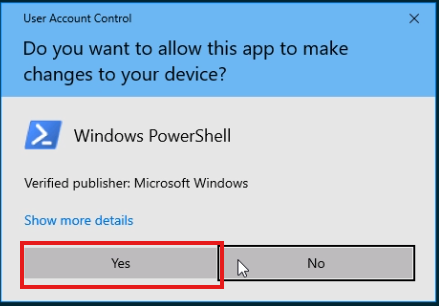
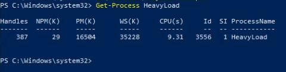
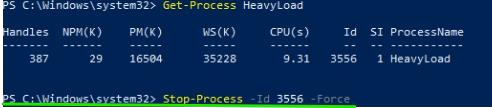
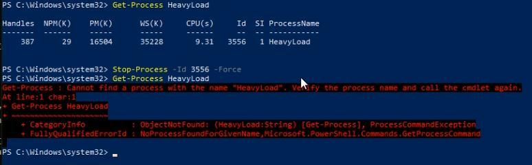
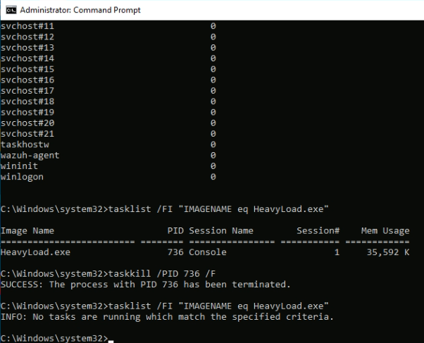
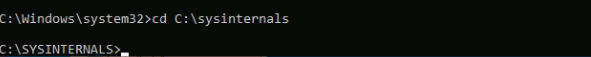
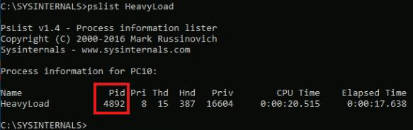
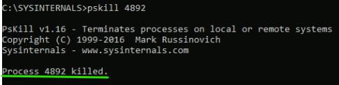
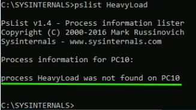
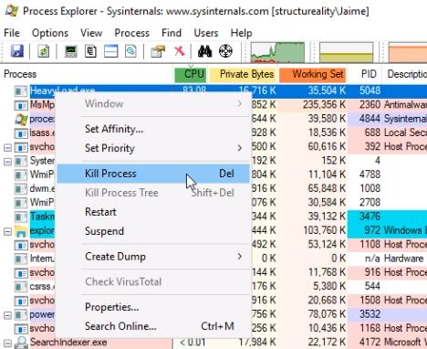
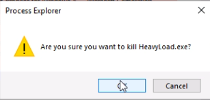
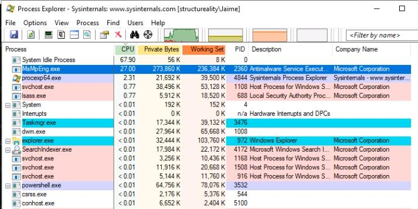
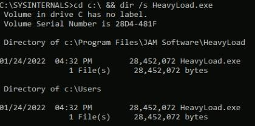
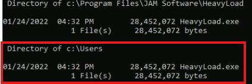
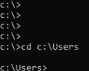
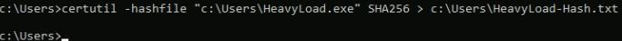
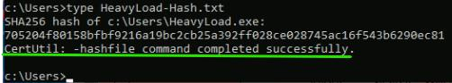
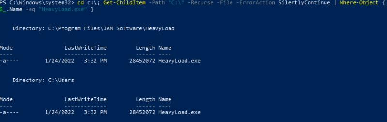
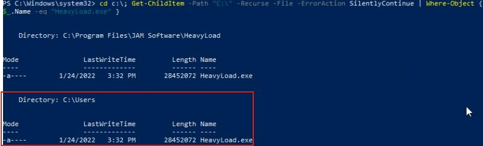
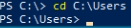
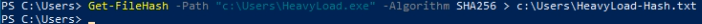
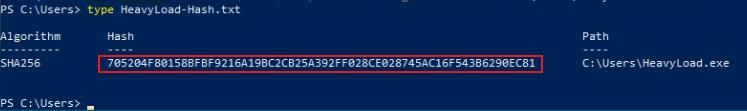
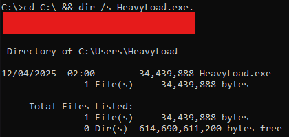
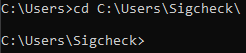
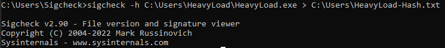
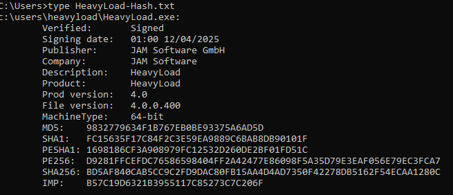
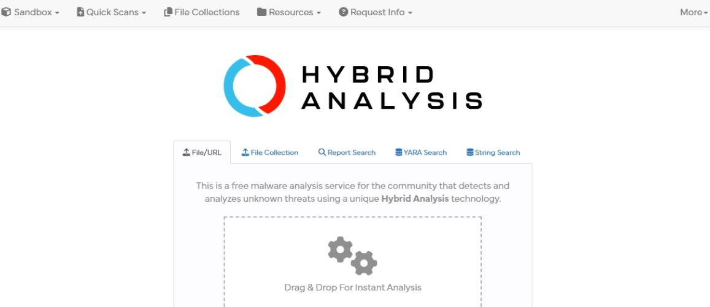
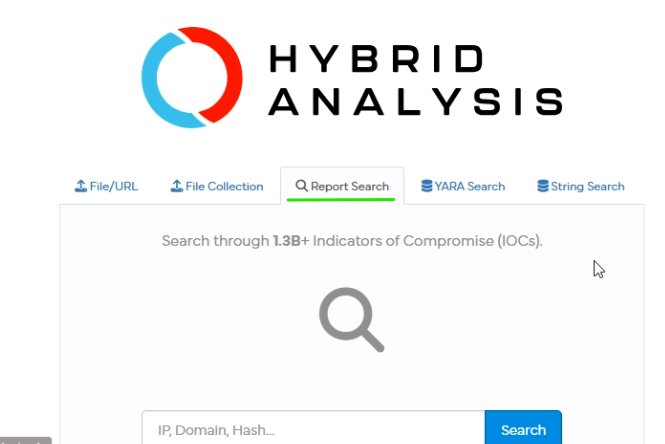
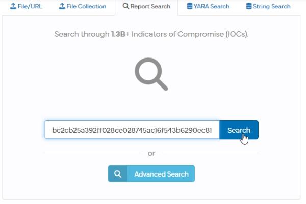
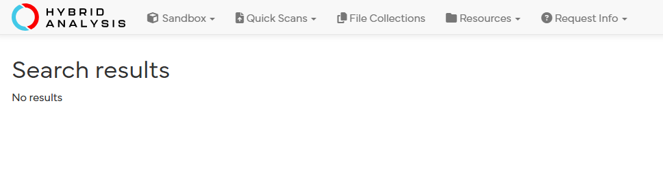


## Key Takeaways
- Contain first; analysis can follow
- Always record hash and file path before removal
- Quarantine artefacts for later review
