# Working with Threat Feeds

As a security team member, you are working to improve your organization's security stance. This lab focuses on making you aware of threat feeds and other online security resources. First, we will explore IoC sources offering threat feeds. Finally, we will explore Exploit Database. 

## Objectives
- Search indicators (domains, IPs, hashes) and review pulses/collections.
- Extract related IoCs and context for detections.
- Record access/registration considerations for team use.
- Explaining various activities associated with vulnerability management. 

## Tools & Techniques
- Threat intel portals (OTX, etc.)
- Browser + CSV exports

## Table of Contents

[Understanding IoC and threat intelligence sources](#Understanding-IoC-and-threat-intelligence-sources)
[Explore The Exploit Database](#Explore-The-Exploit-Database)

---

## Understanding IoC and threat intelligence sources 

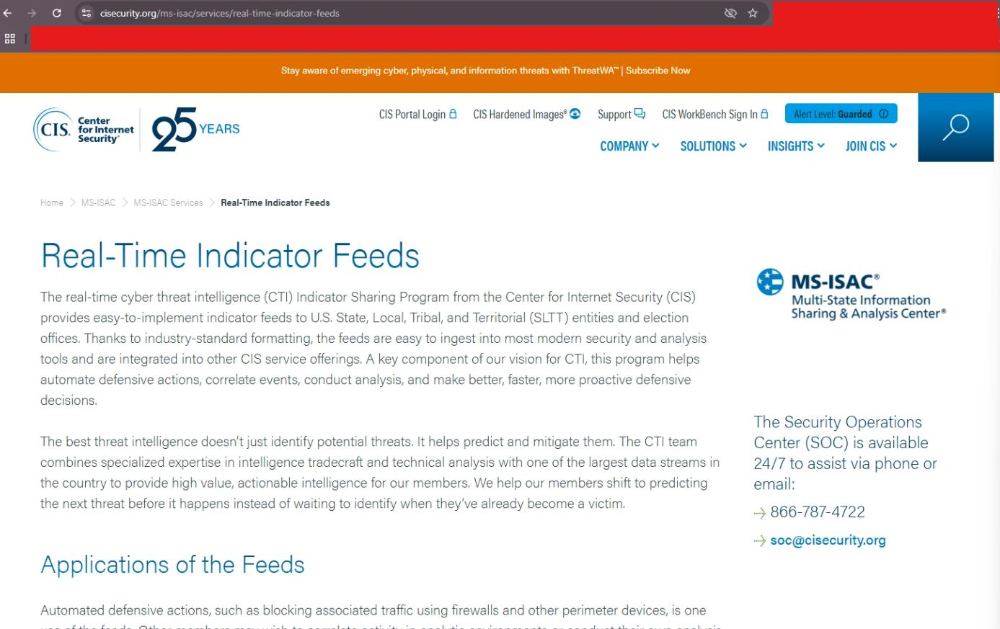
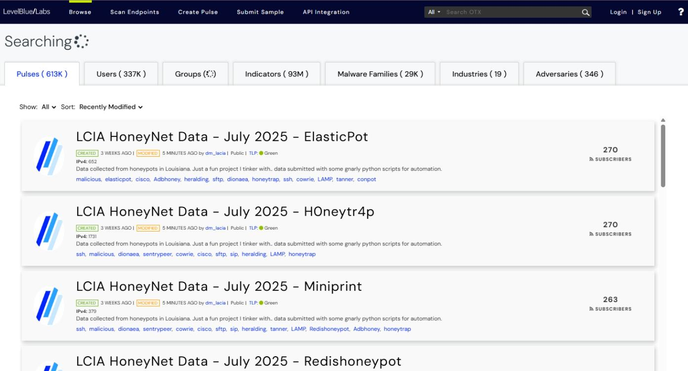
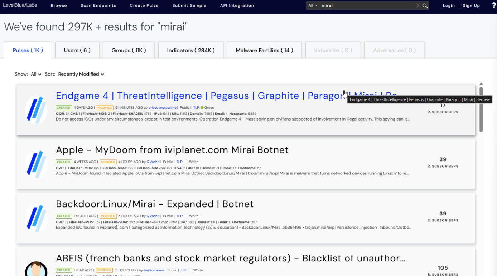

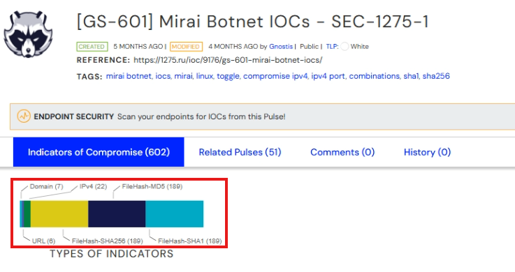
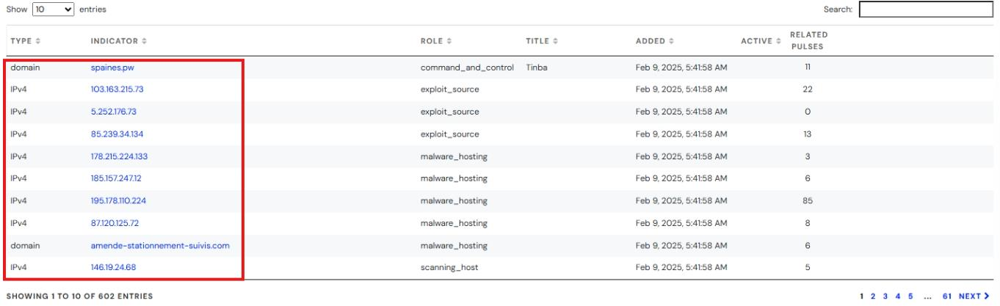
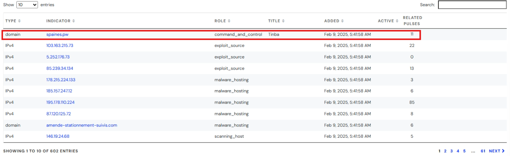
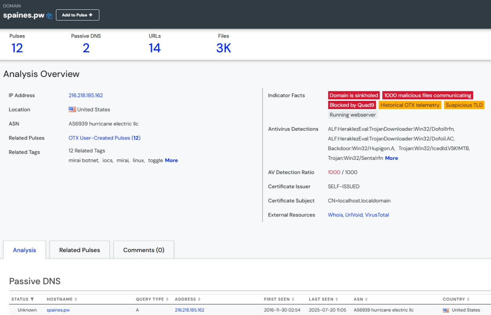
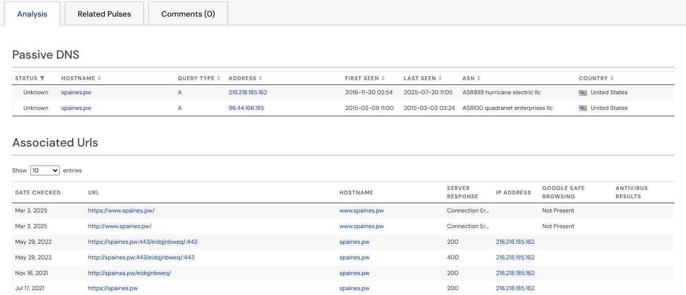
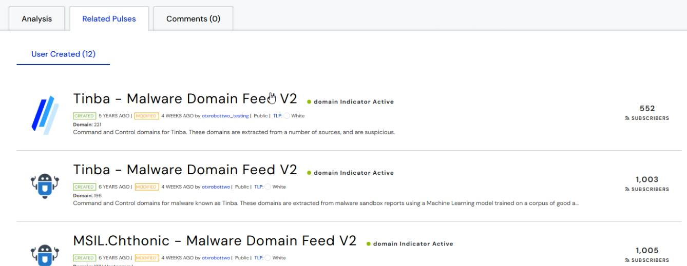
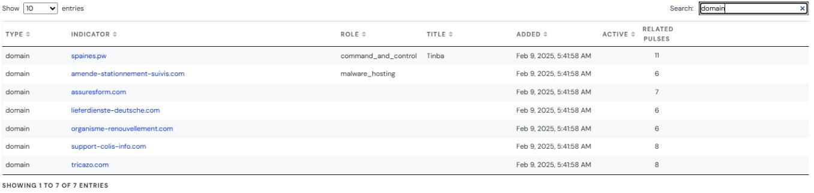
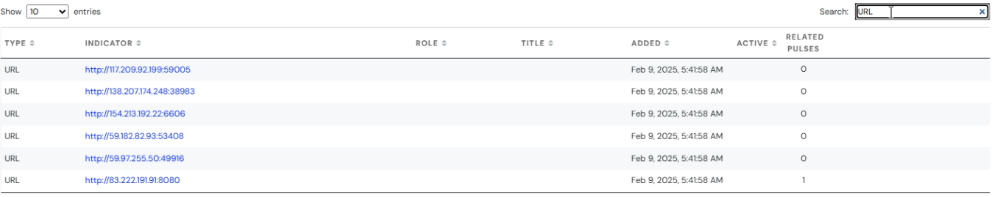
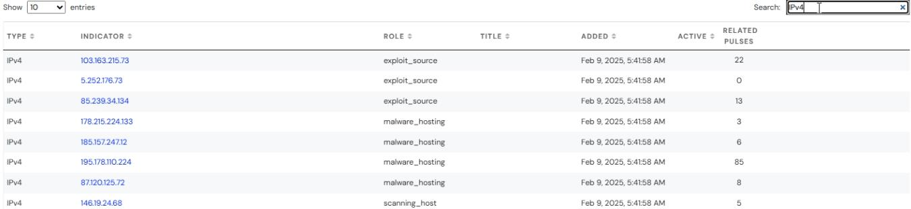
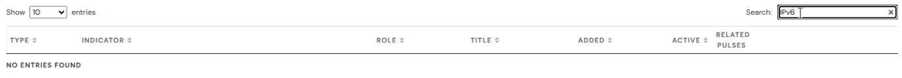
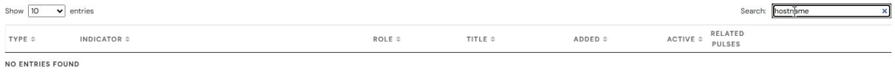
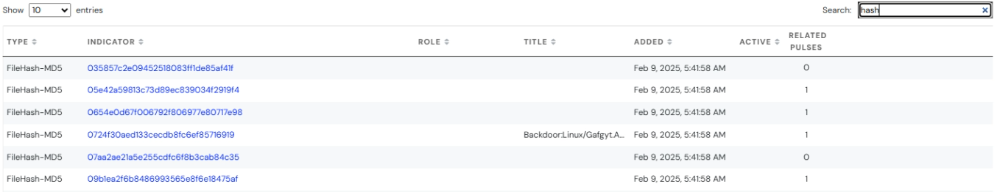

---

## Explore The Exploit Database 

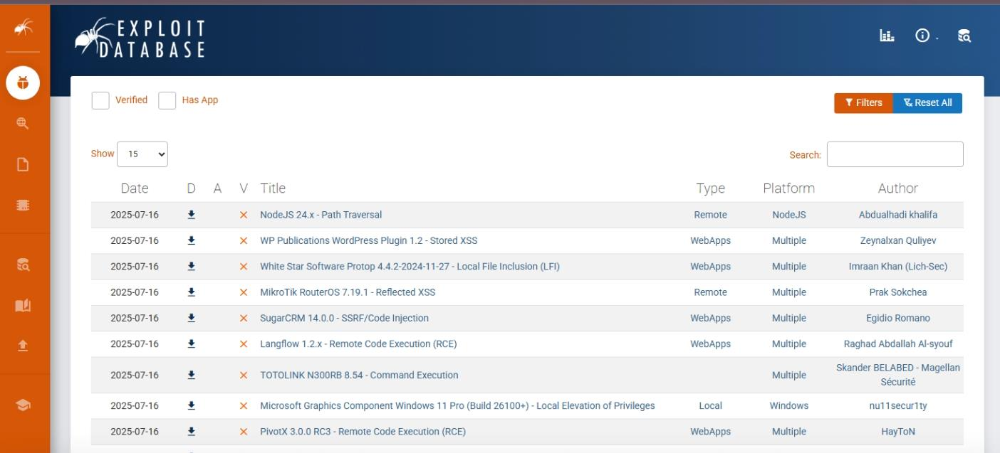
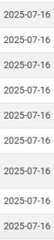
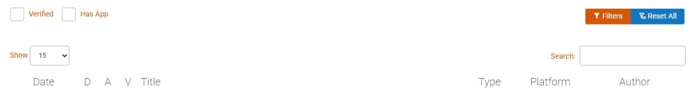
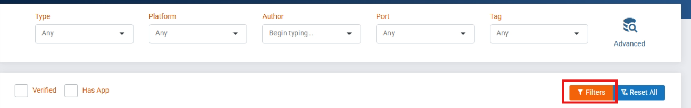
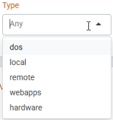
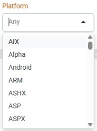
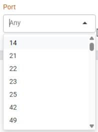
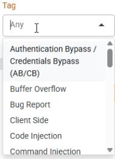
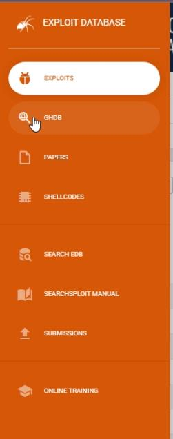
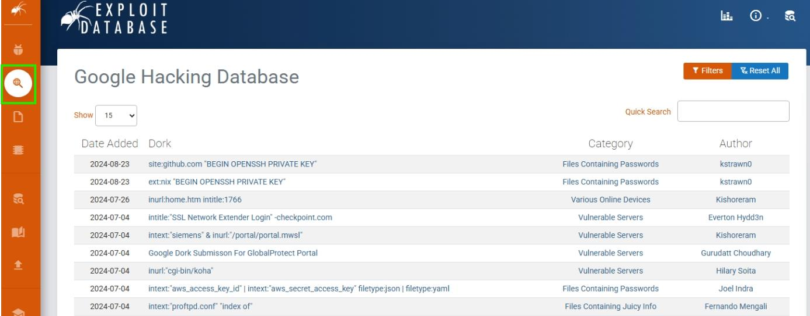
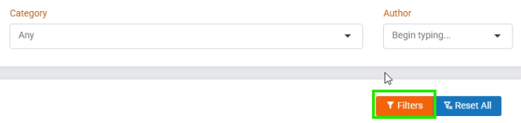
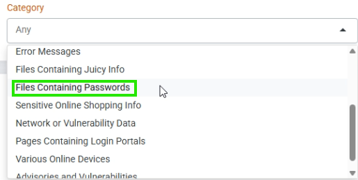
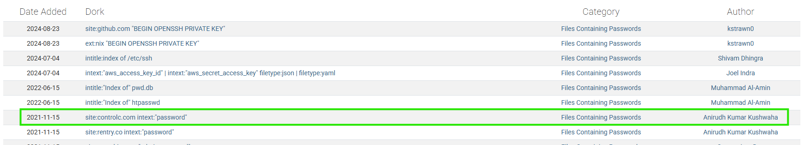
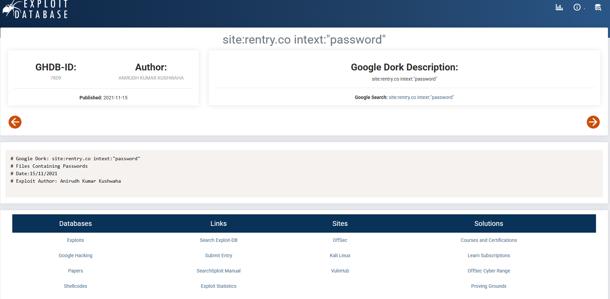
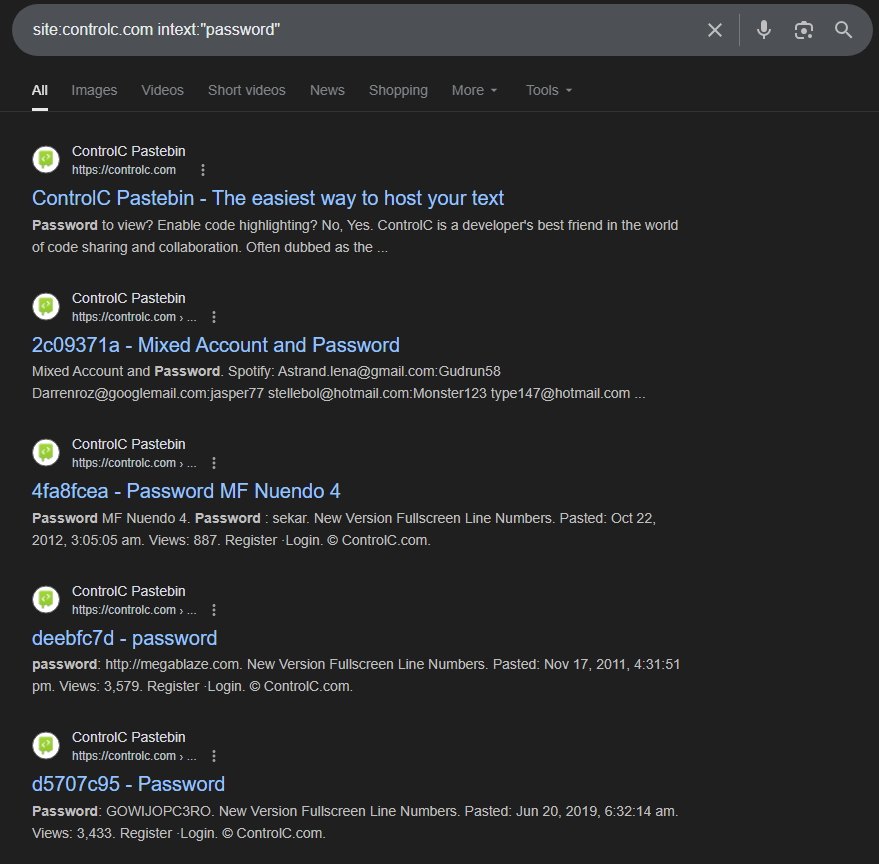
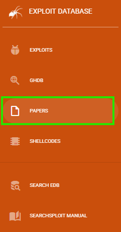
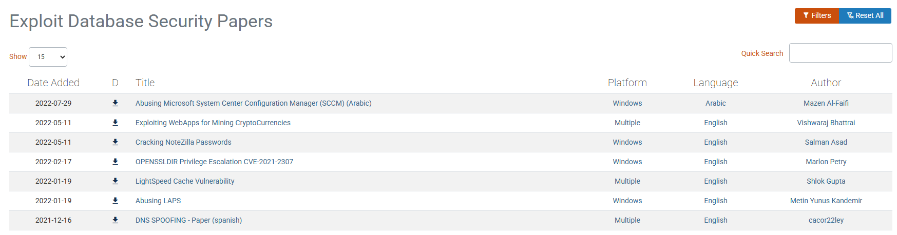
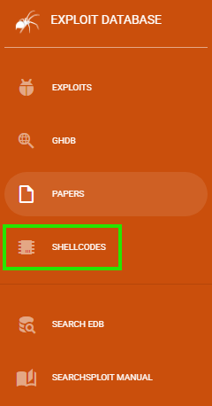
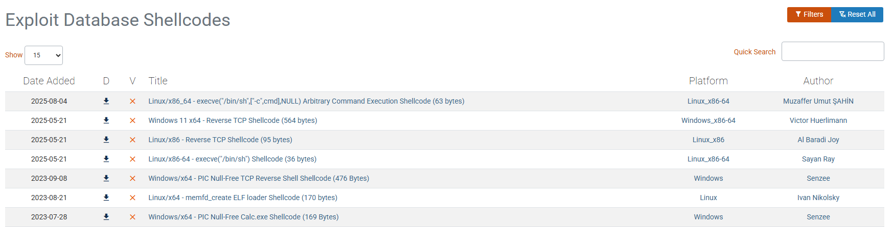
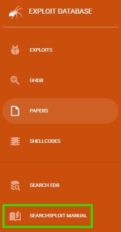
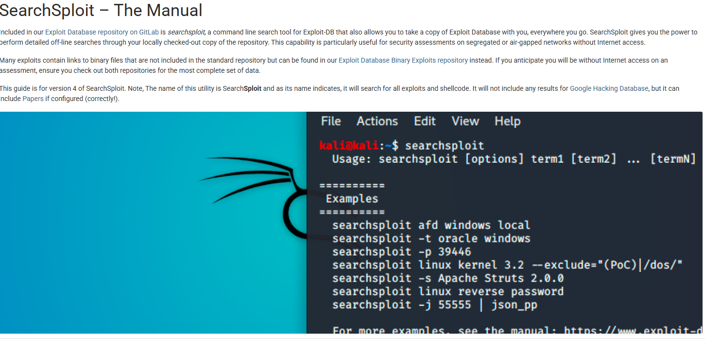

---

## Key Takeaways
- Threat intel is a starting point; always verify in your logs
- Normalise IoCs for easy import into detections
- Document access controls and API usage for repeatability
